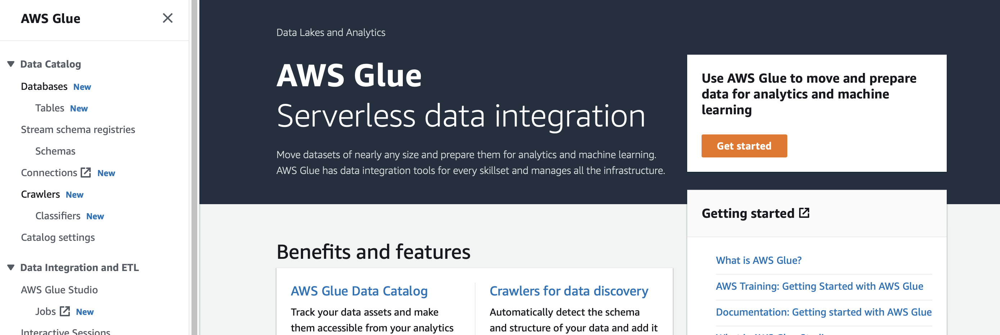
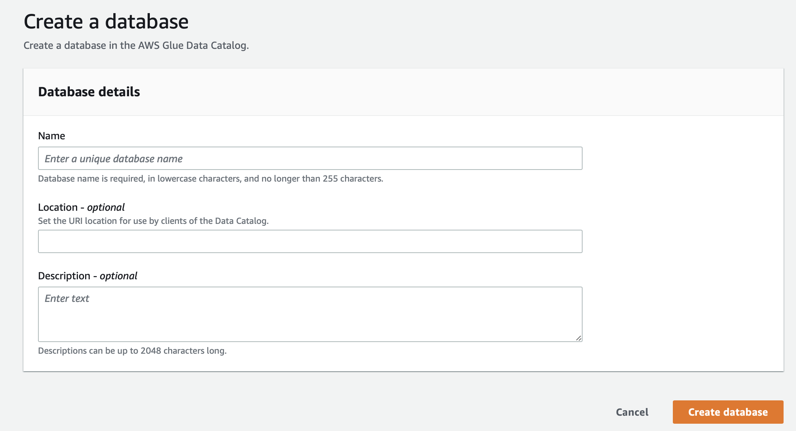
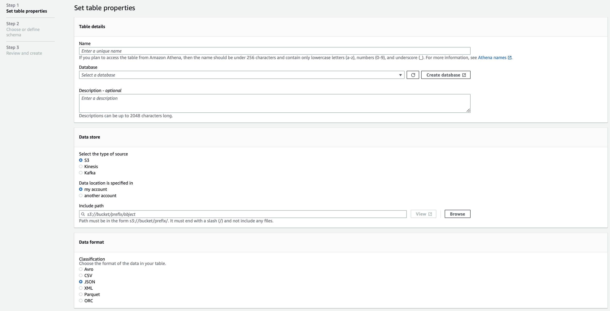
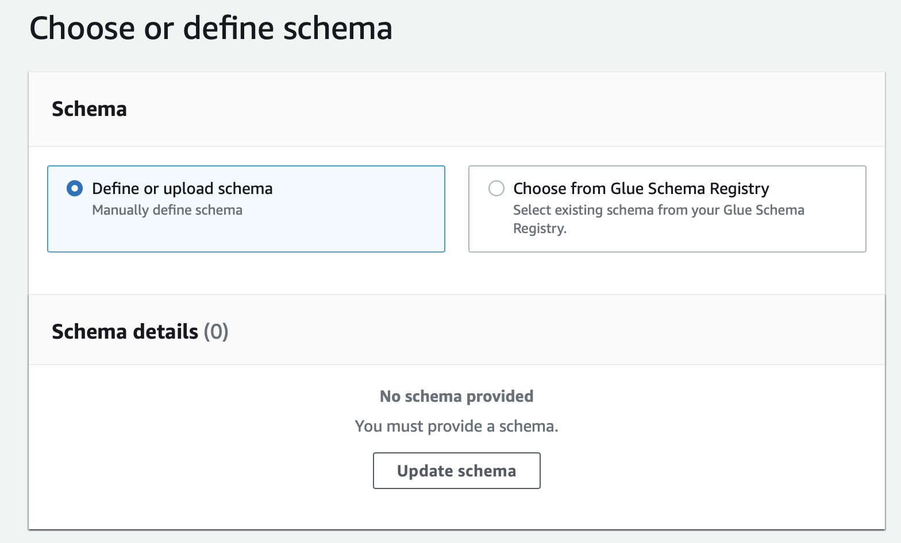
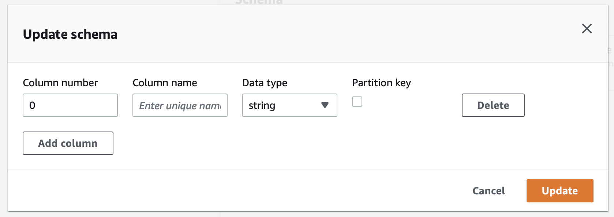

# AWS Athena

AI 모델에서 나온 추론 데이터를 AWS RDS로 즉석으로 넣어주고 있었다.

RDS서버가 scale-out으로 인한 연결 수 증가와 입력 데이터량이 커짐에 따라 모니터링이 필요해지고 RDS 자체도 스케일링이 필요해지자 많은 추론데이터를 관리할 방법이 필요해졌다.


데이터 발생 상황은 아래와 같았다.

- 1초당 30Mb 정도의 입출력이 필요하다.
  - 쿼리 자체는 작지만 상당히 많은 수`> 1만` 의 동시 접속자가 발생한다.
- 접속자 순간 트레픽이 높아서 RDS의 스케일링이 자주 필요하다.


이때 두가지 문제점이 발생하는데,

1. RDS의 유지비용이 크게 들어간다.
2. RDS scaling이 자주 일어나고 그에 따라서 데이터 저장 불안정성이 크게 늘어난다.


그래서 대용량 데이터를 처리하기 위해서 다양한 방법들을 고민해보았다.

- Data warehouse(DW)로 AWS redshift를 사용하고 apache airflow를 통해서 로그를 redshift에 저장.
- 로그 자체를 S3에 저장하고 S3 selection, AWS athena, Redshift Spectrum 이용하기


이중에 새롭게 알게된 사실이 있었는데 아래 항목에 해당하는 방법들은 RDBMS를 구성하지 않고 s3에 올라가있는 특정 형태의 데이터들을 통해서 쿼리를 통해 데이터를 읽어올 수 있었다. (이렇게 되면 저장 용도의 로그는 이편이 이득!)

단점으로는 쿼리를 날릴때 table로 지정된 버킷을 스캔하게 되는데 이때 partitioning이 제대로 되어있지 않은상태로 대용량 데이터를 읽어오게 되면 비용이 많이 청구된다... (이게 진짜 무섭다.. 🥲)


## Athena의 특징

우선 athena를 테스트하기 전에 athena에 대해서 알아보았다. 생소했던 부분 위주로 작성하려고 한다.

> Athena에 관련한 자세한 정보는 reference의 *Amazon Athena 설명서*에서 자세하게 볼 수 있다.


#### 권한

Athena를 이용하기 위해서 관련 권한이 필요했다. 나는 Athena와 Glue 서비스에 대한 권한을 요청하였다.


#### SQL

Amazon Athena는 내부적으로 분산 SQL 엔진인 Presto를 사용한다. 

잘 모르는 엔진이였고 data type이나 여러 sql 관련 함수나 문법은 AWS 홈페이지에 잘 나와있다.


#### Database & Table

AWS Glue의 데이터 카탈로그를 보면 Database와 Table을 생성할 수 있다. 이때 Table에 S3의 특정 위치를 등록하면 해당 위치에 있는 파일들을 데이터로 읽을 수 있다.

여기서 `SerDe` 라는 생소한 내용이 하나 더 나오게 된다.


#### S3에 저장된 데이터의 형태

Athena는 `CSV`, `JSON`, `Avro`, `Parquet`과 함께 기타 형식도 지원한다. 나는 json을 이용하였는데 여러 다른 파일형식도 이용해보면 좋을것 같다.(상황에 맞춰서..)

##### SerDe

SerDe(Serializer/Deserializer)는 Athena가 다양한 형식의 데이터와 상호 작용하는 한 방식이라고 한다. 즉 S3에 저장된 파일에 따라서 SerDe를 잘 지정해줘야 파일을 잘 읽을 수 있다. 아래는 JSON에 대한 SerDe를 적용하는 예시이다.

```sql
CREATE TABLE selling (..)
ROW FORMAT SERDE 'org.apache.hive.hcatalog.data.JsonSerDe'
```


## Database & Table 설정

Athena를 이용하기 위해서는 AWS Glue를 통해서 Database와 table을 생성해주어야 한다.

Glue는 AWS의 ETL(Extract, Tramsform, Load) 서비스로 여러 기능들을 지원한다. 여기서는 s3의 특정 위치를 table로 지정하는 작업을 해보려고 한다.

> 개인적으로 <u>프로그래머스 스쿨</u>에서 진행하는 [실리콘 밸리에서 날아온 데이터 엔지니어링 스타터 키트](https://school.programmers.co.kr/learn/courses/14783)를 들었는데 ETL과 관련한 다양한 정보를 접할 수 있고 데이터 현업자 분들과 소통할 수 있어서 좋았던것 같다. (왜 광고 같지;;)


### 0. 비용을 줄이기 위한 장치

앞서 말한것처럼 Athena는 S3를 스캔하는 용량만큼 비용이 청구된다. 

스캔하는 데이터의 용량과 양을 줄일수록 쿼리시 지출되는 비용을 줄일 수 있다. 이를 위해서 여러가지 장치들을 제공하는데 가장 접근하기 쉬운것이 아래의 두가지 이다. 여기서는 partition만 적용해보려고 한다.

- partition
- compression


#### partition

Athena에서 partition은 자동, 수동 두가지 방식이 제공된다. 여기서는 자동&Hive 스타일 파티션을 이용할 것이며 자동 방식은 S3 버킷의 디렉터리에 명시적으로 partioning을 지정해주면 된다.

자동의 경우에는 Hive 스타일 파티션과 비 Hive 스타일 파티션로 나뉘는데 Hive 스타일 파티션이 더 간단하기 때문에 (사실 기존에 다른 서비스에서 이렇게 사용중이라서..) Hive 스타일 파티션으로 적용하였다.

Athena 사용 설명서에는 다음과 같이 설정하라고 한다.

> Athena는 Apache Hive 스타일 파티션을 사용할 수 있습니다. 이 파티션의 데이터 경로에 등호로 연결된 키 값 페어가 포함되어 있습니다(예: `country=us/...` 또는 `year=2021/month=01/day=26/...`). 따라서 경로에는 파티션 키의 이름과 각 경로가 나타내는 값이 모두 포함됩니다. 

바로 아래에 다음과 같은 구문이 있는데 이게 매우 중요하다. 나는 이부분을 지나쳐서 데이터가 로드가 안되고 데이터 타입과 table 생성이 잘못된 문제로 착각하고 시간을 많이 낭비하였다. (역시 문서를 잘 읽어야 한다..)

> 파티션을 나눈 테이블에 새 Hive 파티션을 로드하려면 [MSCK REPAIR TABLE](https://docs.aws.amazon.com/ko_kr/athena/latest/ug/msck-repair-table.html) 명령을 사용할 수 있으며 이 명령은 Hive 스타일 파티션에서만 작동합니다.

이부분에 대해서는 아래에서 다시할 예정이다.


### 1. AWS Glue에서 Data Catalog 설정하기

aws의 검색에 Glue로 검색하면 아래와 같은 화면이 나오는데 좌측의 버튼을 눌러주면 아래와 같은 화면을 볼 수 있다. 좌측에 있는 Database, Table을 설정해주면 된다.

> crawlers 등을 통해서 s3에서 원하는 부분만 가져올 수 있다는데 아직 조사가 안되어서 일단 pass 해본다.





Database의 생성은 매우 간단하다. 아래의 항목들을 입력하고 생성해주면 된다.



Table의 경우에는 조금더 복잡한데 사실 별거 없다. 총 3개의 스텝으로 나뉘어 있다.




두번째 스탭에서 테이블을 정의해주는데 위에서 언급했던것처럼 파티션을 적용하는 컬럼들의 경우에는 `Partition key`에 체크를 해주어야 한다.






### 2. Athena 콘솔에서 쿼리로 생성하기

Glue의 Data Catalog 콘솔이 아닌 Athena의 콘솔에서도 바로 Database와 Table을 생성할 수 있다.

Database를 생성은 아래와 같이 할 수 있다.

```sql
CREATE DATABASE car;
```


Table은 조금더 신경써야 한다. S3에 저장되어있는 파일의 구조에 따라 작성해야하고 partition도 신경써주어야 한다.

우선 `s3://car_books/logs` 위치에 다음과 같은 json 파일이 저장되어있다고 가정한다.

> Json 안에 Json 항목이 있는 경우 여러가지 방법을 시도해보았는데 presto의 json 함수를 사용하는 방식으로 적용하였다. 아래처럼 데이터로 들어가는 json은 문자열 형태로 저장한다. 한줄에 json 하나씩 작성하면 된다.

~~~json
{"type": "sedan", "manufactured" : "2010-07-30 08:00:00", "year": 2022, "month": 8, "day": 16, "accident" : 0, "option" : "{\"sun_loop\": 1, \"navi\": 1}"}
{"type": "suv", "manufactured" : "2012-01-23 09:13:00", "year": 2022, "month": 8, "day": 16, "accident" : 3, "option" : "{\"sun_loop\": 0, \"navi\": 1}"}
~~~


이때 테이블은 아래와 같이 작성할 수 있다. 테이블을 생성할때는 `EXTERNAL`로 설정을 해주어야 한다.
주의해야 하는 부분 파티션의 지정과 파일을 읽기위한 SerDe의 설정 부분이다.

> Athena 콘솔에서 table 생성시에는 좌측에 데이터 메뉴에서 데이터베이스가 잘 설정되어있는지 살펴보자.

```sql
CREATE EXTERNAL TABLE selling (
  type string,
  manufactured timestamp,
  accident integer,
  option string
) 
PARTITIONED BY (
  year integer,
  month integer,
  day integer
)
ROW FORMAT SERDE 'org.apache.hive.hcatalog.data.JsonSerDe'
LOCATION 's3://car_books/logs';
```


역시 여기서도 문제가 발생했었는데 파티션으로 등록하고자 하는 컬럼은 Table 컬럼에서 빼주어야한다. 중복으로 적용하는 경우 오류가 발생한다.

~~~
FAILED: SemanticException [Error 10035]: Column repeated in partitioning columns
~~~


### 3. 파티션 리프레시

이제 파티션을 Athena가 인식할 수 있도록 지정 해주어야 한다. 파티션이 인식되기 전까지는 쿼리를 아무리 날려도 조회가 되지 않는다. (나는 이부분을 지나쳐서 오랜시간을 낭비했다..)

~~~sql
MSCK REPAIR TABLE car.selling;
~~~

~~~
Partitions not in metastore: selling:year=2022/month=8/day=16
Repair: Added partition to metastore car.selling:year=2022/month=8/day=16
~~~


## 쿼리 TEST

앞서 말한것처럼 Athena는 쿼리시 스캔한 비용만큼 비용이 지불된다. 따라서 테스트할때는 limit을 지정해주는것이 좋다.

~~~sql
SELECT * 
FROM car.selling 
LIMIT 5;
~~~


앞서 설정한 json 변수를 가져오기 위해서는 presto의 json 함수를 사용할 수 있다.

~~~sql
SELECT 
	json_extract(option, '$.sun_loop') sun_loop,
	json_extract(option, '$.navi') sun_loop,
FROM car.selling 
LIMIT 5;
~~~


#### p.s.

- 앞서 사용한 table인 `car.selling`은 `"car"."selling"`과 같이 작성해도 된다.


#### Reference

- [Amazon Athena 설명서](https://docs.aws.amazon.com/ko_kr/athena/latest/ug/what-is.html)
- [Amazon Athena 설명서 - 압축 지원](https://docs.aws.amazon.com/ko_kr/athena/latest/ug/compression-formats.html)
- [Amazon Athena 설명서 - SerDe 사용](https://docs.aws.amazon.com/ko_kr/athena/latest/ug/serde-about.html)
- [Amazon Athena 설명서 - 데이터 분할](https://docs.aws.amazon.com/ko_kr/athena/latest/ug/partitions.html)
- [Presto 0.276 Documentation](https://prestodb.io/docs/current/functions/json.html)
- [Amazon Athena 초간단 사용기 - Amazon Web Services 한국 블로그](https://aws.amazon.com/ko/blogs/korea/amazon-athena-sql-compatible-query-series/)
- [AWS Athena를 사용해서 S3 데이터 조회해보자 -  번개장터](https://www.theteams.kr/teams/7937/post/70685)
- [Amazon S3 Select 및 Glacier Select - Amazon Web Services 한국 블로그](https://aws.amazon.com/ko/blogs/korea/s3-glacier-select/)
- [Amazon Redshift Spectrum을 사용하여 외부 데이터 쿼리](https://docs.aws.amazon.com/ko_kr/redshift/latest/dg/c-using-spectrum.html)
