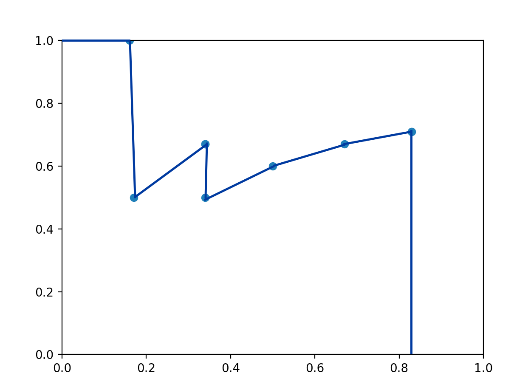
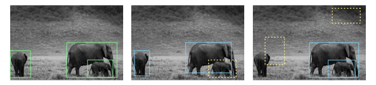
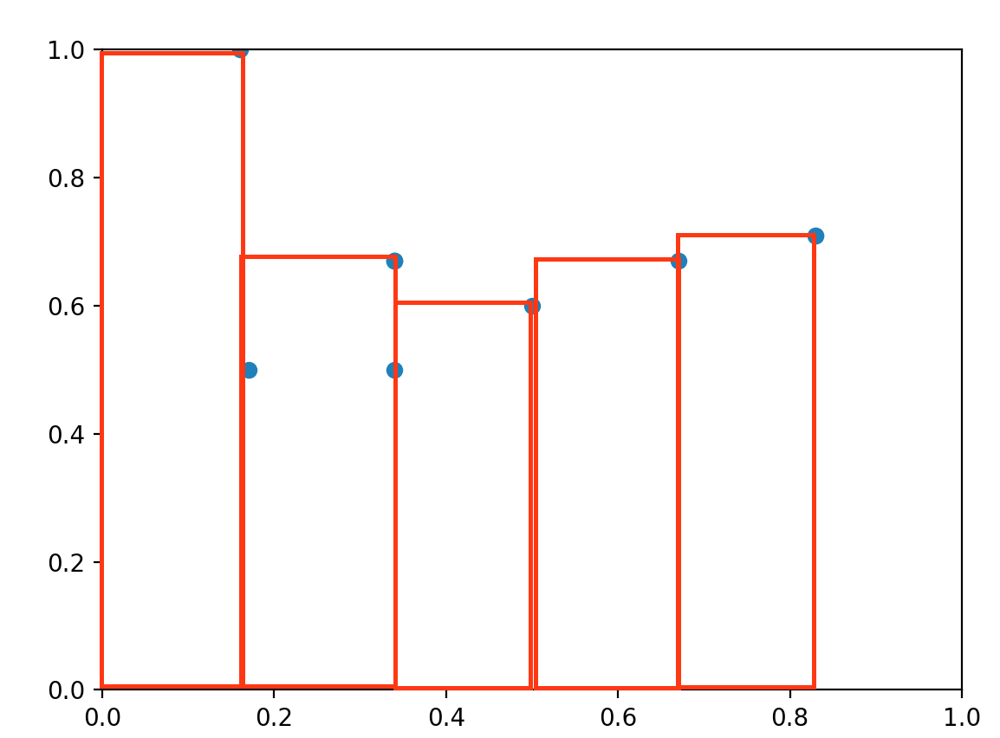

# mAP 란?

mAP(mean Average Precision)는 자주 사용되고 Detection에서는 빠질 수 없는 지표이다. 

하지만 이번에 회사에서 운영 부서에서  <u>"Detection모델의 성능이 어떻게 되나요?"</u> 라는 질문을 받았을때 쉽게 대답할 수 없었다. <u>"저희 모델은 `mAP@0.5`가 0.89이상 나옵니다!"</u> 하는데 어떻게 받아들일까?


이미 mAP 관련 글은 넘쳐나지만 누군가 보고 쉽게 이해할 수 있도록 정리를 해보려고 글을 작성해본다.


## Precision과 Recall

Precision 과 Recall을 이해하기 위해서 우선 간단한 binary classification 모델의 10개 데이터에 대한 출력 결과를 살펴보자.   
여기서는 class에 대한 모델의 class probability에 따라 정렬을 해둔 상태이다.
> 모델에 따라서 계산 방식이나 표현이 다르지만 confidence는 `class에 대한 probabiliy`로 생각하면 된다.
{: .prompt-tip }


| confidence | 10% | 20% | 30% | 40% | 50% |60%|70%|80%|90%|100%|
| ---------------------- | ---- | ---- | ---- | ---- | ---- |---- |---- |---- | ---------------------- | ---------------------- |
| Ground Truth(정답) | 0 | 1 | 1 | 1 | 0 |1|0|1|0|1|
| Prediction (예측) | 0 | 1 | 1 | 1 | 1 |0|0|1|1|1|


### Precision

Precision(정밀도)는 얼마나 정밀한지 알아보는 지표이다. 즉, <u>모델이 정답이라고 결론을 내렸는데 그중에서 얼마만큼이 진짜 답인지를 나타내는것</u>이다. 이는 아래처럼 계산할 수 있다. (confusion matrix에 대해서 잘 모른다면 Appendix 참고)


$$Precision = {TP \over {TP + FP}}$$


### Recall

Recall은 한국말로 재현률이다. 즉 얼마나 상황이 재현되었냐가 궁금한 지표이다. 즉, <u>실제 True 중에서 얼마나 True라고 예측된걸까?</u> 를 알아보는 지표이다.

$$Recall = {TP \over{TP + FN}}$$   

</br>

자 이제 다시 돌아와서 위의 출력결과를 살펴보자.   
우리는 모델의 출력을 그대로 믿지않고 모델의 confidence를 가지고 결론을 내리게 된다. 예를 들어서 70% 이상의 정확도를 보인 예측만 True로 인정한다면 아래의 표와 같이 그 아래의 확률에 대해서는 0으로 예측이 바뀌게 된다.

| confidence | 10% | 20% | 30% | 40% | 50% |60%|70%|80%|90%|100%|
| ---------------------- | ---- | ---- | ---- | ---- | ---- |---- |---- |---- | ---------------------- | ---------------------- |
| Ground Truth(정답) | 0    | 1    | 1    | 1    | 0    | 1    | 0    | 1    | 0    | 1    |
| Prediction (예측) | 0    | 0    | 0    | 0    | 0    | 0    | 0    | 1    | 1    | 1    |


> 이때 TP는 2개, FP는 1개, FN는 4개다. 따라서 Precision과 Recall은 각각 0.67, 0.34이다.


문제는 여기서 발생하는데 설정한 모델 정확도 기준을 바꾼다면 성능도 바뀔 수 있다. 예를들어서 50% 이상의 정답을 True로 인정한다면 다음과 같이 된다.

| confidence         | 10%  | 20%  | 30%  | 40%  | 50%  | 60%  | 70%  | 80%  | 90%  | 100% |
| ------------------ | ---- | ---- | ---- | ---- | ---- | ---- | ---- | ---- | ---- | ---- |
| Ground Truth(정답) | 0    | 1    | 1    | 1    | 0    | 1    | 0    | 1    | 0    | 1    |
| Prediction (예측)  | 0    | 0    | 0    | 0    | 1    | 0    | 1    | 1    | 0    | 1    |


> 이때 TP는 2개, FP는 2개, FN는 4개다. 따라서 Precision과 Recall은 각각 0.5, 0.34이다.


위의 결과와 비교해보면 단순히 threshold만 바꾸어줬는데 성능이 바뀐것이다. 이때 모든 threshold에서 성능을 알아보려면 Precision - Recall 그래프를 그려보면 된다.


우선 그래프를 그려보기 위해서 위의 각 threshold별 Precision과 Recall을 알아보자.

| confidence | 10%  | 20%  | 30%  | 40%  | 50%  | 60%  | 70%  | 80%  | 90%  | 100% |
| ---------- | ---- | ---- | ---- | ---- | ---- | ---- | ---- | ---- | ---- | ---- |
| Precision  | 0.71 | 0.71 | 0.67 | 0.6  | 0.5  | 0.67 | 0.67 | 0.67 | 0.5  | 1    |
| Recall     | 0.83 | 0.83 | 0.67 | 0.5  | 0.34 | 0.34 | 0.34 | 0.34 | 0.17 | 0.17 |


이를 그래프로 그려보면  다음과 같다.

{: width="600" }

이때 파란선 아래쪽의 넓이를 구해보면 threshold와 상관없이 Precision, Recall 값에 의한  모델의 성능을 평가할 수 있다.


## Detection?

이제 Detection의 예측 결과를 살펴보자. 

Detection의 예측은 `4개의 bounding box` 정보와 `class`, `confidence` 값을 가지고 있다.   
또한 예측한 bounding box가 맞을 수도 있고 물체는 없는데 위치할 수도 있다.   
(아래 사진을 보면 초록색 GT box에 대비해서 정확한 예측(<span style="color:blue;background-color:#e6e6e6">파란색 박스</span>)도 있는 반면 예측이 잘못된 예측(<span style="color:#ffff67;background-color:#c5c5c5">노란색 점선 박스</span>)도 발생한다.)



_<a href="https://pixabay.com/ko//?utm_source=link-attribution&amp;utm_medium=referral&amp;utm_campaign=image&amp;utm_content=7624960">Pixabay</a>로부터 입수된 <a href="https://pixabay.com/ko/users/antonytrivet-3549802/?utm_source=link-attribution&amp;utm_medium=referral&amp;utm_campaign=image&amp;utm_content=7624960">Antony Trivet</a>님의 이미지 입니다._

Detection 모델을 선택하기 위해서 **Prediction bounding box와 GT bounding box 사이의 IOU**, **Prediction box와 GT bounding box의 유무에 따른 confusion matrix의 영향**을 생각해야한다.   

이때 confidence 값을 위의 그래프처럼 Precision-Recall 그래프로 만들어 아래 면적을 구하면  **Prediction box와 GT bounding box의 유무에 따른 confusion matrix의 영향**을 고려하며 모델을 선택할 수 있게된다. 


> 좀더 자세하게 얘기하면 Prediction bounding box는 있는데 GT bounding box가 없는 경우(**FP**)나 Prediction bounding box는 없는데 GT bounding box가 있는 경우(**FN**)를 고려할 수 있다.
{: .prompt-tip }


## mAP 계산하기!

이제 이유를 알았으니 mAP를 구해보자.    
mAP는 각 class에 대한 AP를 평균(mean)낸 값이다. 따라서 AP를 먼저 구해야한다.

이제 precision-recall 그래프를 그리면 된다는것을 알았기 때문에 모든 prediction에 대해서 출력값을 저장해주는 함수를 만든다.

```python
class mAPCalculator():
    def __init__(self):
        # class ap_list shape : (n_classes,)
        self.ap_list = []

        # class confidence list. shape : (all_predictions, n_classes)
        self.all_confidences = None

        # TP, FP list. shape : (all_predictions,) if iou with G.T > threshold, and class is correct, 1 else 0.
        self.all_con_list = None

    def keep(self, cbboxes, cconfidences, target_id):
        '''
        NOTICE: calculate prediction is TP or FP and keep prediction information.
        :param cbboxes: (n_output_boxes, 4)
        :param cconfidences: (n_output_boxes, n_classes)
        :param target_id: {"boxes": boxes, "classes": classes} boxes : [n_target_boxes, [cell_x, cell_y, center_x center_y, w, h]],  classes: [n_target_boxes, category]
        :return:
        '''

        # Calculate which prediction is TP or FP
        cconfidences, con_list = self.calculate_confusion(cbboxes, cconfidences, target_id)

        # Stack confidences of predictions and is TP or FP
        self.all_confidences = cconfidences if self.all_confidences is None else np.concatenate([self.all_confidences, cconfidences], axis=0)
        self.all_con_list = con_list if self.all_con_list is None else np.concatenate([self.all_con_list, con_list], axis=0)
```


위의 함수를 통해서 데이터를 쌓으면 아래와 같은 구조로 데이터가 모이게 된다.

```
1. First, collect all box class, confidence, confusion information. 
(Just calculate precision recall for predictions on all Test Image.)
-----------------------------------------------------------------------------------------------
file        | class(argmax(confidences)) | confidence (:max(confidences)) | confusion
image01.png                 2                           0.88951                   1 (TP)
image02.png                 1                           0.93215                   1 (TP)
image01.png                 0                           0.85331                   0 (FP) 
image01.png                 0                           0.98245                   1 (TP)
image02.png                 2                           0.90457                   0 (FP)
.
.
.
-----------------------------------------------------------------------------------------------        
NOTICE: divide data by class and calculate confusion and merge them again.
NOTICE: when calculate confusion, if duplicated prediction occurred, set 0 confusion to next predictions.  
```


이때 confusion 정보는 GT bounding box와 예측 bounding box간의 IOU에 의해서 결정된다.

```python
def calculate_iou_matrix(*coordinates):
    # Divide to each coordinates.
    x11, y11, x12, y12 = coordinates[:4]
    x21, y21, x22, y22 = coordinates[4:]

    # Choose edge of intersection.
    x_1 = np.maximum(x11, x21)  # intersection Left-Top x
    y_1 = np.maximum(y11, y21)  # intersection Left-Top y
    x_2 = np.minimum(x12, x22)  # intersection Right-Bottom x
    y_2 = np.minimum(y12, y22)  # intersection Right-Bottom y

    # Calculate intersection area.
    inter_area = np.maximum((x_2 - x_1), 0) * np.maximum((y_2 - y_1), 0)

    # Calculate iou.
    box1_area = (x12 - x11) * (y12 - y11)
    box2_area = (x22 - x21) * (y22 - y21)
    iou = inter_area / (box1_area + box2_area - inter_area + 0.001)

    return iou

def calculate_confusion(self, cbboxes, cconfidences, target):
        '''
        :param cbboxes: shape: (n_output_boxes, 4) ;[top_left_x, top_left_y, bottom_right_x, bottom_right_y]
        :param cconfidences: shape:(n_output_boxes, n_classes)
        :param target:  {"boxes": boxes, "classes": classes} boxes : [n_target_boxes, [cell_x, cell_y, center_x center_y, w, h]],  classes: [n_target_boxes, category]
        
        :return:
        cconfidences: valid prediction boxes. shape: (n_valid_predictions, 1); ex) 0.73456
        con_list: valid prediction boxes is correct or not. shape: (n_valid_predictions, 1); 1 is TP, 0 is FP.
        '''

        # Remove not valid boxes from two list.
        valid = np.max(cconfidences, axis=1) > 0

        # Remove zero confidence boxes.
        cconfidences = cconfidences[valid]
        cbboxes = cbboxes[valid]

        # Get classes.
        classes = np.argmax(cconfidences, axis=1)

        # TP, FP list.  # TP or FP : TP is 1, FP is 0
        con_list = np.zeros([len(cbboxes), 1], dtype=int)

        # Calculate AP for each class.
        for c in range(cfg.N_CLASSES):

            # Get each class boxes.
            output_boxes = cbboxes[np.where(classes == c)]

            # Target boxes flag. It is for prevent duplicated prediction.
            target_flag = np.zeros([len(np.where(np.array(target['classes']) == c)[0]), ], dtype=int)

            # target_boxes(G.T bounding boxes) on specific class.
            target_boxes = np.array(target['boxes'])[np.where(np.array(target['classes']) == c)]

            # Set TP, FP
            for tdx, t_box in enumerate(target_boxes):

                # Compare with 'output_boxes' and calculate IOU. next, set TP or FP
                for bdx, output_box in enumerate(output_boxes):

                    # each box shape : top_left_x, top_left_y, bottom_right_x, bottom_right_y
                    iou = calculate_iou_matrix(*output_box, *YOLO2CORNER(t_box))
                    # print(f'iou : {iou}')

                    # If TP, (generally, iou >= 0.5)
                    if iou > cfg.VALID_OUTPUT_THRESHOLD and target_flag[tdx] == 0:
                        # Set to TP.
                        con_list[np.where(classes == c)[0][bdx]] = [1]

                        # Set flag to 1. (when calculate AP, duplicated detection at last come to not correct prediction.)
                        target_flag[tdx] = 1

        return cconfidences, con_list
```


> 이 코드에서는 IOU threshold를 0.5로 잡았기 때문에 mAP를 구하는 경우 `mAP@0.5`로 표기할 수 있다.
논문을 보면 `mAP@0.5:0.95` 라는 표현을 볼 수 있는데 이는` mAP@0.5`부터 `mAP@0.95`까지 0.05간격 값의 평균을 낸 값이다.
{: .prompt-tip }


이제 데이터를 다 모았으면 confusion 값을 이용해서 Precision과 Recall 값을 계산한다.


### AP 계산

AP는 하나의 class에 해당하는 Precision-Recall 그래프를 그려보면 된다.

```
|
|---------;
|         |
|         |
|         | 
|    A    |
|         ----------;
|         .    B    |
|         .         ----------;      
|         .         .    C       ...
|_______________________________________
|         |
T1        T2    ...
```

```python
def calculate_AP(self, class_id, pre_rec):
        '''
        :param class_id: class id.
        :param pre_rec: shape : (n_prediction_boxes, 2); [precision, recall]
        :return: AP
        '''

        # Tn points.
        threshold = np.unique(pre_rec[:, 1])

        # Sum of below region.
        val_AP = 0

        for tdx, th in enumerate(threshold):
            # Calculate portion(A) divided by threshold.
            if tdx == 0:
                val_AP += np.max(pre_rec[:, 0][pre_rec[:, 1] <= th]) * th

            else:
                # Calculate portion(B, ...) divided by threshold.
                val_AP += np.max(pre_rec[:, 0][(threshold[tdx - 1] < pre_rec[:, 1]) & (pre_rec[:, 1] <= th)]) * (th - threshold[tdx - 1])

        return val_AP
```

{: width="600" }


여기서 작성한 코드에서는 유니크한 Recall값에 대해서만 대략적인 넓이를 구하고 있다. 일반적으로는 <u>11 point interpolation</u>, <u>All point interpolation</u> 을 사용하게 된다. (Apeendix 참조)


### 각 class에 대해 AP 구하고 평균 구하기

이제 AP를 구하는 코드를 작성했으니 앞서 데이터를 쌓아두었던 데이터를 confidence 순으로 정렬한다. 그리고 각 class 별로 테이블을 분리하여 각 class별 AP를 계산해준다.

```

2. Sort by descending confidence.
(Don't need to know about which predictions are placed on which image because just calculate precision recall for all predictions.)
-------------------------------------------------------------------------------
class(argmax(confidences)) | confidence (:max(confidences)) | confusion
0                           0.98245                   1 (TP)
1                           0.93215    |              1 (TP)
2                           0.90457    |              0 (FP) 
2                           0.88951    V              1 (TP)
0                           0.85331                   0 (FP)
.
.
.
-------------------------------------------------------------------------------            

3. divide matrix by class and calculate precision and recall.
-------------------------------------------------------------------------------

=================================class0================================
class(argmax(confidences)) | confidence (:max(confidences)) | confusion
0                           0.98245                   1 (TP)
0                           0.85331                   0 (FP)
.
.
.
=================================class1================================
class(argmax(confidences)) | confidence (:max(confidences)) | confusion
1                           0.93215                   1 (TP)
.
.
.
=================================class2================================
class(argmax(confidences)) | confidence (:max(confidences)) | confusion
2                           0.90457                   0 (FP) 
2                           0.88951                   1 (TP)
.
.
.
-------------------------------------------------------------------------------

4. Calculate mAP or just show AP of each class.   
```

```python
def calculate(self, plot=True, mean=True):
        '''
        :param plot:
        :param mean:
        :return:
        '''

        # sort all confidence.
        classes = np.argmax(self.all_confidences, axis=1)
        all_confidences = np.max(self.all_confidences, axis=1)

        # Get sorted index by  descending class confidence
        sorted_index = np.argsort(all_confidences, axis=0)[::-1]

        # Sort confidence by descending order.
        all_confidences = np.squeeze(all_confidences[sorted_index])
        if cfg.N_CLASSES == 1: all_confidences = np.expand_dims(all_confidences, axis=-1)
        all_con_list = np.squeeze(self.all_con_list[sorted_index])

        for c in range(cfg.N_CLASSES):
            # Using 'all_predict', 'output_confidences' and 'con_type', calculate AP for each class.

            # choose specific class.
            one_class_confidence = all_confidences[np.where(classes == c)]
            one_class_con_list = all_con_list[np.where(classes == c)]

            # calculate TP +FN, all box predictions for in each class.
            all_predict = sum(one_class_con_list)

            # Precision and recall.
            pre_rec = np.zeros([len(one_class_confidence), 2])

            # Calculate precision and recall.
            for row in range(len(one_class_confidence)):
                precision = sum(one_class_con_list[:row + 1]) / (row + 1)
                recall = sum(one_class_con_list[:row + 1]) / all_predict

                # Update pre_rec
                pre_rec[row] = [precision, recall]

            # Add to ap_list (AP for each class.) shape:[C]
            ap = self.calculate_AP(c, pre_rec, plot)
            print(f'AP_{cfg.CLASS_NAME[c]} : {ap}')
            self.ap_list.append(ap)

        return np.mean(self.ap_list) if mean else self.ap_list
```


이렇게 정리하고 보니 더 설명하기 애매해진 것 같다.

그냥 사용 예시를 남기고 마무리 한다.

```python
cal_mAP = mAPCalculator()

for iteration, (img, target) in enumerate(test_loader):
    # For calculate FPS.
    before = time.time()

    inputs = torch.stack(img)
    outputs = model(inputs)

    # TEST: without NMS
    for id, output in enumerate(outputs):
        img = np.transpose(inputs[id].detach().numpy(), [1, 2, 0])

        # output boxes after NMS.
        # cbboxes shape : [n_output_boxes, 4]
        # cconfidences shape : [n_output_boxes, n_classes]
        cbboxes, cconfidences = non_maximum_suppression(output)

        # Keep predict boxes information for calculate mAP.
        cal_mAP.keep(cbboxes, cconfidences, target[id])

# Calculate mAP.
result = cal_mAP.calculate(plot=True, mean=True)
print(f'mAP : {result}')
```

>  위의 코드는 scratch로 [전체적인 detection의 구조를 설명하고자 만들었던 프로젝트](https://github.com/hololee/YOLO_LITE)의 일부 코드이다. non_maximum_suppression 코드나 기타 내용을 보고 싶으면 레포를 살펴보면 좋을것 같다.
{: .prompt-info }

   
<br>

# Appendix

## Confusion matrix (2 x 2)

| -           | -    | 실제 정답      |                |
| ----------- | ---- | -------------- | -------------- |
| -           | -    | 1              | 0              |
| 모델의 출력 | 1    | True Positive  | False Positive |
|             | 0    | False Negative | True Negative  |

위의 그래프에서 볼 수 있듯, 위의 지표들의 의미는 다음과 같다.


- `TP`(True Positive) : 맞는 긍정이다 (모델이 맞다(Positive, 1)고 했더니 진짜더라(True))
- `FP`(False Positive) : 틀린 긍정이다 (모델이 맞다(Positive, 1)고 했더니 알고보니 아니더라(False)) 
- `TN`(True Negative): 맞는 부정이다 (모델이 아니다(Negative, 0)고 했더니 진짜더라(True))
- `FN`(False Negative): 틀린 부정이다 (모델이 아니다(Negative, 0)고 했더니 알고보니 아니더라(False))


## 11 point interpolation
11 point interpolation은 말그대로 Precision-Recall 그래프에서 Recall값을 11단계로 나누고 그 점들의 Precision 값을 interpolate해서 아래 면적을 구한다.

계산 수식은 다음과 같다.

$$\mathbf{AP} = {1\over11} \sum_{r \in \left\{0, 0.1,...,1\right\}} \rho_{\mathbf{interp}(r)}$$

$$\rho_{\mathbf{interp}(r)} = \max_{\tilde{r}:\tilde{r} \ge r} \rho(\tilde{r})$$

수식을 살펴보면 $r$이 0일때 0보다 큰 Recall 값중에서 Precision 값이 max인 값을 선택하고 0.1일때는 0.1보다 큰 Recall값 중에서 Precision값이 max인 값을 선택하는 식으로 11개의 point에 대해 계산을 하면 된다.


## Interpolating all points
11 point 방식과 다르게 모든 지점에 대해서 interpolating을 수행하게 된다. 

$$\sum_{n=0}(r_{n+1} - r_{n}) \rho_{\mathbf{interp}(r)} (r_{n+1})$$

$$\rho_{\mathbf{interp}(r)} (r_{n+1}) = \max_{\tilde{r}:\tilde{r} \ge r_{n+1}} \rho(\tilde{r})$$

수식을 살펴보면 앞서 11 point 방식에서는 다음 $r$이 고정되는것과는 다르게 다음 $r_{n+1}$을 $r_{n}$으로 선택해주면 된다.

<br>

# Reference

[1] [rafaelpadilla/Object-Detection-Metrics#11-point-interpolation](https://github.com/rafaelpadilla/Object-Detection-Metrics#11-point-interpolation)   
[2] [Pascal VOC challenge](http://host.robots.ox.ac.uk/pascal/VOC/)   
[3] [Pascal VOC challenge paper](http://host.robots.ox.ac.uk/pascal/VOC/pubs/everingham15.pdf)   
[4] [https://www.waytoliah.com/1491](https://www.waytoliah.com/1491)   
[5] [https://ctkim.tistory.com/79](https://ctkim.tistory.com/79)   
[6] [https://junha1125.tistory.com/51](https://junha1125.tistory.com/51)   
[7] [https://jonathan-hui.medium.com/map-mean-average-precision-for-object-detection-45c121a31173](https://jonathan-hui.medium.com/map-mean-average-precision-for-object-detection-45c121a31173)
