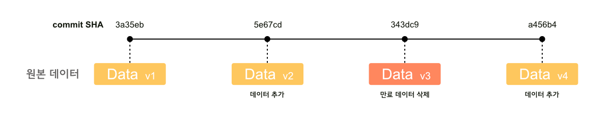
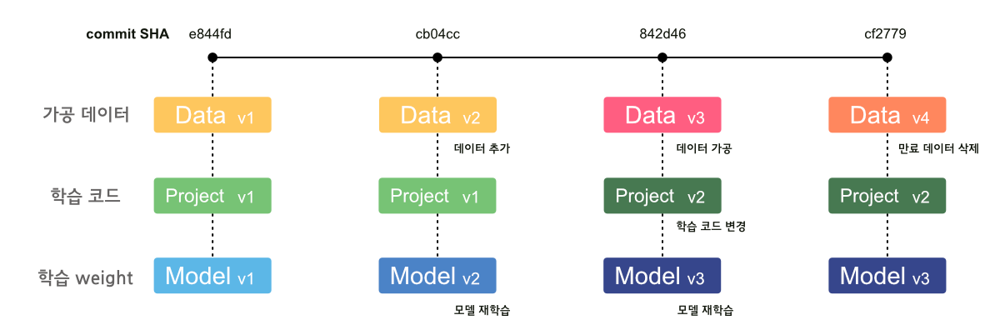

# DVC

비슷한 라이브러리: **Pachyderm**

git을 통해서 데이터의 버전을 관리하고 실제 데이터는 cloud나 로컬에서 관리할 수 있다. git에 큰 용량을 저장하지 않고도 데이터의 버저닝을 관리할 수 있어서 유연하게 활용할 수 있다.

dvc doc을 보면 자세한 설명이 되어있고 여기서는 간단하게 `AWS s3`와 연동시켜서 관리하는 방법을 테스트해보려고 한다[[1](https://dvc.org/doc/start)].

개발환경이 mac(silicon)이여서 mac 기준으로 진행하였다.

## Install

~~~
brew install dvc
~~~

## Setup

dvc 자체는 데이터와 dvc 파일의 연결을 관리하는 도구이다. 데이터 자체의 버전이나 상태 관리는 git을 통해 이루어진다. (이부분이 조금 불편한데 dvc 커멘드로 모두 해결되는것이 아닌 git과 함께 사용해야 의미가 있다.)

### project setup

프로젝트를 dvc로 관리하려면 git 프로젝트 안에서 아래의 명령어를 실행한다.

 ~~~bash
 dvc init
 ~~~

디렉터리를 확인해보면 여러 설정파일들이 생긴것을 알 수 있는데 이를 git으로 관리해주어야한다.

~~~ bash
git status  
git commit -m 'Initialize DVC'
~~~

## Data management

### Data versioning

이제 실질적으로 데이터를 관리해보는 연습을 진행하였다.

가상의 데이터 data.json 파일을 만들어본다.

~~~ bash
echo "{\"test\": \"test data.\"}" >> test.json  
dvc add test.json
~~~

데이터를 생성하고 dvc를 통해서 데이터를 관리에 추가해주면 아래와 같은 문구가 뜬다.

~~~bash
To track the changes with git, run:  
  git add test.json.dvc .gitignore  
To enable auto staging, run:  
  dvc config core.autostage true
~~~

아래의 설정을 해두면 자동으로 git stage에 등록해줘서 따로 add를 해줄 필요가 없어진다.

~~~bash
dvc config core.autostage true
~~~

`.dvc/config`에 setting이 추가되어서 git을 통해 또 등록해주자.  

~~~bash
git add .dvc/config  
git commit -m 'Autostage config changed.'
~~~

이처럼 변화가 생기면 잊지말고 git에 커밋을 날려줘야 기록이 남는다.

~~~bash
git commit -m 'Add test data'
~~~

#### 외부 저장소에 연결

##### S3 연결

이제 이렇게 추가한 데이터를 원격 저장소로 올려서 관리할 수 있다. 본인 같은 경우는 aws S3를 이용하고 있어서 해당 정보를 등록해주었다. 더 자세한 자료는 doc의 리모트 설정법 페이지를 확인해보면 좋다[[3](https://dvc.org/doc/command-reference/remote/add)]. (물론 여기서도 변화하는 정보를 git을 통해서 관리해주어야 한다.)

~~~bash
dvc remote add -d storage s3://bucket_name/dir_name  

git add .dvc/config  
git commit -m 'Configure remote storage'
~~~

일반적으로 AWS authentication은 CLI configuration을 따라가는데 SSO 같은 특별한 경우에는 [다른 방법을 활용](https://dvc.org/doc/command-reference/remote/modify#amazon-s3)할 수 있다. 나 같은 경우는 sso를 사용하고 있고 프로필로 등록해둔 상황이라서 아래와 같은 방법으로 인증을 등록하였다[[2](https://dvc.org/doc/command-reference/remote/modify)].

~~~
aws sso login --profile {profile_name}  
dvc remote modify --local storage profile {profile_name}
~~~

> 여기서 --local 옵션을 주는 경우 gitignore에 추가되기 때문에 여러명이서 사용하는경우 필요하다고 한다.
{: .prompt-info }

#### 데이터 저장

데이터를 저장하기 위해서는 매우 간단하다. 위에서 파일 추가 후 git commit까지 완료된 상황에서 아래의 명령어를 입력한다.

~~~bash
dvc push
~~~

#### 데이터 로드

데이터를 가져오는것도 간편하다. 만약의 상황을 위해서 위에서 만들었던 파일 `test.json`을 삭제하고 아래의 명령어를 입력하면 s3에서 가져오는것을 볼 수 있다.

~~~bash
dvc pull
~~~

#### 데이터 변경

데이터 변경이 발생하는 경우도 처리는 간단하다. 다만 이때는 버전 관리를 위해서 git을 이용해야 한다. (항상 데이터 버전관리는 git을 이용한다는 개념을 숙지하면 될듯 하다.)

 ~~~bash
 // 새로운 데이터 추가.  
 echo "{"test": "test2 data."}" >> test2.json  
 dvc add test2.json  
 
 git commit -m 'Data added'  
 dvc push
 ~~~

#### 데이터 삭제

데이터를 삭제하는 방법은 크게 두가지로 단계로 나뉜다.

1.  `.dvc` 파일 삭제
    
2.  원격 스토리지에서 데이터 삭제
    

첫번째 단계는 각 파일을 삭제할 수 있다[[6](https://dvc.org/doc/command-reference/remove#remove)].

~~~bash
dvc remove test.json.dvc  
//or  
rm test.json.dvc
~~~

두번째 단계는 캐시와 원격 스토리지에 저장된 데이터를 제거하는 작업이 필요하다. `gc` 명령을 통해서 캐시와 원격 스토리지의 데이터를 정리할 수 있다[[5](https://dvc.org/doc/command-reference/gc#gc)].

~~~bash
// -a: clear in this branch, -c: clear remote storage  
dvc gc -ac
~~~

#### 데이터의 버전 관리

데이터의 버전 관리를 위해서 git branch를 이용할 수 있다.

역시 여기서도 변화된 `.dvc` 파일들에 맞는 파일들을 설정하기 위해서 dvc 커멘드를 이용한다.

~~~bash
git checkout version_2  
dvc checkout
~~~

### 데이터 파이프라인

DVC에서는 간단한 데이터 파이프라인 (simple ETL process)를 stage로 명칭하고 있다. 이 파이프라인은 dvc가 관리중인 데이터를 스크립트를 통해서 처리하도록 만들어진다. 이때 스크립트는 git으로 관리된다[[4](https://dvc.org/doc/start/data-management/data-pipelines#pipeline-stages)].

(예제에서는 python 스크립트를 사용하는데 다른것도 되는지 모르겠다. 아마 python 프로젝트라서 python만 지원할지도..)

데이터 파이프라인 부분은 이어서 다음 포스트에서 작성할 예정이다.

## DVC를 이용한 프로젝트 관리

DVC를 이용해서 학습용 프로젝트와 데이터 프로젝트를 나눠서 관리하는 방법을 고안해보았다. 
[DVC docs](https://dvc.org/doc/use-cases/versioning-data-and-models)에도 간단히 설명이 되어있지만 내 방식대로 설계를 해보았다.

1. 데이터를 관리하는 Repository를 생성한다.
2. 각 branch는 하나의 Task나 Data를 의미한다.

이때 branch type은 Task branch와 Data branch로 나뉘고 아래의 구조를 가진다.

### Data branch

`Data branch`는 학습용 코드에 무관하게 데이터만 관리해야할때 사용한다. 예를들어서 ETL에 의해서 주기적으로 데이터가 만들어지거나 데이터 유효기간에 의해서 주기적으로 삭제가 되어야 하는 데이터의 경우에는 아래처럼 버전 관리를 진행할 수 있다.

### Task branch

`Task branch`는 데이터와 학습용 코드, 학습 weight를 함께 관리한다. 이때 학습용 weight는 다른 툴 (ex. `MLflow`)을 통해서 별도로 관리할 수 있다. 데이터는 주로 가공된 데이터로 학습용코드, weight에 맞는 데이터를 함께 보관한다. 

이처럼 관리하면 추후에 어떤 데이터와 코드로 어떤 모델을 학습시킨건지 확인이 용이하다.

# Reference

[1] [https://dvc.org/doc/start](https://dvc.org/doc/start)   
[2] [https://dvc.org/doc/command-reference/remote/modify](https://dvc.org/doc/command-reference/remote/modify)   
[3] [https://dvc.org/doc/command-reference/remote/add](https://dvc.org/doc/command-reference/remote/add)   
[4] [https://dvc.org/doc/start/data-management/data-pipelines#pipeline-stages](https://dvc.org/doc/start/data-management/data-pipelines#pipeline-stages)   
[5] [https://dvc.org/doc/command-reference/gc#gc](https://dvc.org/doc/command-reference/gc#gc)   
[6] [https://dvc.org/doc/command-reference/remove#remove](https://dvc.org/doc/command-reference/remove#remove)
