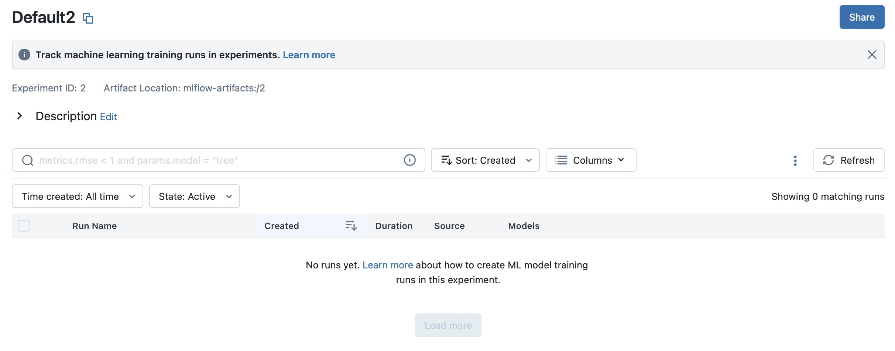

# MLflow Tracking Server (UI)

MLflow Tracking server를 활용하면 로컬에서 로깅한 여러 정보들을 웹 화면에서 한눈에 볼 수 있습니다.

아직 기능들이 세밀한 조절이 불가능하기는 하지만 충분히 좋은 성능을 보여줍니다.


MLflow server를 동작하기 위해서는 아래의 명령어를 입력하면 됩니다.

```bash
mlflow ui
# 또는.
mlflow server
```

위의 명령어로 실행시키는 경우 실행한 디렉터리 위치에 `mlruns`라는 폴더가 생성되며 여기에 로깅한 데이터와 로깅한 파일이 저장됩니다.

안정성을 위해서 데이터 저장소를 분리할 수 있는데 이를 위해서는 mlflow 백엔드 서버 구조를 조금 살펴봐야합니다.

MLflow server 구조를 간단히 설명하면 저장하는 데이터의 형태에 따라서 `Backend Stores`와 `Artifact Stores`로 나뉘게 됩니다.


## Backend Stores

BackendStores는 Experiments나 로깅 메트릭등 정형화 될 수있는 데이터를 보관하는 저장소로 DB에 연결하여 사용할 수 있습니다.

크게 파일형태의 저장방식과 DB 방식의 저장방식을 선택할 수있으며 각각 세팅은 다음과 같이 할 수 있습니다.

- A file store backend as `./path_to_store` or `file:/path_to_store`
- A database-backed store as [SQLAlchemy database URI](https://docs.sqlalchemy.org/en/latest/core/engines.html#database-urls). The database URI typically takes the format `<dialect>+<driver>://<username>:<password>@<host>:<port>/<database>`. MLflow supports the database dialects `mysql`, `mssql`, `sqlite`, and `postgresql`. Drivers are optional. If you do not specify a driver, SQLAlchemy uses a dialect’s default driver. For example, `--backend-store-uri sqlite:///mlflow.db` would use a local SQLite database.


mlflow 버전 업그레이드에 따른 데이터 스케마의 변화에 따라서 오류가 날 수도 있어서 아래와 같은 업데이트 방식도 제공하고 있습니다.

> `mlflow server` will fail against a database-backed store with an out-of-date database schema. To prevent this, upgrade your database schema to the latest supported version using `mlflow db upgrade [db_uri]`. Schema migrations can result in database downtime, may take longer on larger databases, and are not guaranteed to be transactional. You should always take a backup of your database prior to running `mlflow db upgrade` - consult your database’s documentation for instructions on taking a backup.
{: .prompt-warning }

MLflow Docs를 보면 mlflow server를 위한 여러가지 시나리오를 제공하고 있는데 데이터와 파일을 안전하게 따로 분리해서 관리하기 위해서 시나리오 5번을 선택하였습니다.


## Artifact Stores

Artifact Stores는 학습을 진행하면서 발생하는 파일들(학습 weight, 그래프 이미지, 출력 결과 등등)을 보관하는 저장소입니다.

다음과 같은 방법으로 연결할 수 있습니다. (각 방법에 대한 연결방법이 링크에 나와있습니다.)

- [Amazon S3 and S3-compatible storage](https://www.mlflow.org/docs/latest/tracking.html#amazon-s3-and-s3-compatible-storage)
- [Azure Blob Storage](https://www.mlflow.org/docs/latest/tracking.html#azure-blob-storage)
- [Google Cloud Storage](https://www.mlflow.org/docs/latest/tracking.html#google-cloud-storage)
- [FTP server](https://www.mlflow.org/docs/latest/tracking.html#ftp-server)
- [SFTP Server](https://www.mlflow.org/docs/latest/tracking.html#sftp-server)
- [NFS](https://www.mlflow.org/docs/latest/tracking.html#nfs)
- [HDFS](https://www.mlflow.org/docs/latest/tracking.html#hdfs)


저는 세팅을 위해서 Backend Store로 PstgreSQL을 선택하였고 Artifact Store로 AWS S3를 선택하였습니다.

각각의 세팅에 맞춰서 서버를 실행시키려면 다음과 같이 입력하면 됩니다.

```bash
mlflow server \
  --backend-store-uri postgresql:~ \
 --artifacts-destination s3://mlflow \
  --host 0.0.0.0
```

외부에서도 접속이 가능하도록 `0.0.0.0`을 host로 열어주었습니다.


이제 웹에 접속해보면 다음과 같은 화면을 볼 수 있습니다.




앞선 포스트에서도 말했다시피 MLflow는 아래와 같은 기능들을 제공하고 있습니다.

- [MLflow Tracking](https://mlflow.org/docs/latest/tracking.html)
- [MLflow Projects](https://mlflow.org/docs/latest/projects.html)
- [MLflow Models](https://mlflow.org/docs/latest/models.html)
- [MLflow Mpdel Registry](https://mlflow.org/docs/latest/model-registry.html)


하지만 Tracking을 제외한 다른 기능들을 위해서는 프로젝트 구조를 맞춰야하는 부분이 있어서 의존성을 높히지 않기 위해서 우선은 Tracking 기능 위주로 사용하기로 결정하였습니다.


다음 포스트에서는 이전 포스트에서도 간략하게 설명했지만 Tracking 관련 사용법에 대해서 알아보도록 하겠습니다.
