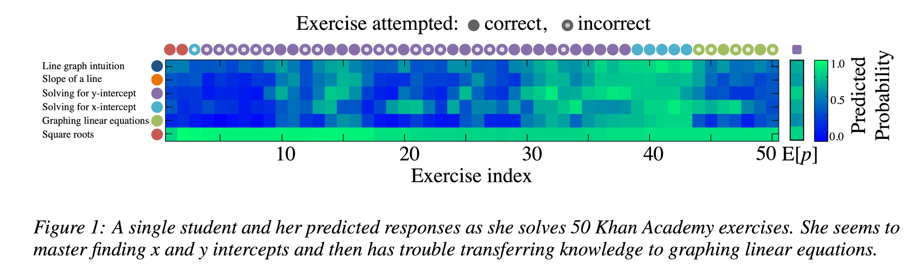
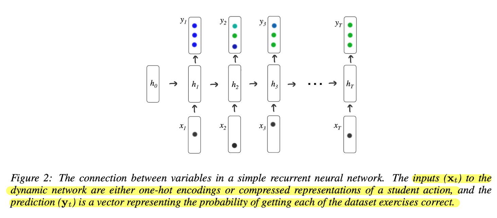

# Knowledge Tracing 이란

학생들의 시간에 따른 지식 정보(어떤 유형을 잘 배웠는지, 못하는지)를 모델링하는 task. 이렇게 모델링된 함수를 사용하여 학생들이 다음 문제를 풀었을때의 맞고 틀리고를 예측할 수 있다.

Deep Knowledge Tracing(DKT) 이전의 Knowledge Tracing은 제한된 형태의 Markov chain을 기반으로한 모델이 대부분이였다. 

# Deep Knowledge Tracing

유연한 RNN을 적용해서 시간에 따른 knowledge tracing이 가능함을 보임.

- RNN 모델을 적용
- 기존의 Knowledge Tracing 모델들 보다 AUC에서 25% 정도의 향상이 있음
- 학생들의 문제나 관계에 따른 전문적인 annotation이 필요하지 않음
- 문제들의 영향이나 문제 커리큘럼을 작성하는데 도움을 줄 수 있음을 제시

## Knowledge Tracing 문제 정의

특정 learning task에 대한 학생들의 interaction(문제를 풀고 맞거나 틀린 상황)이 $$\mathbf{x}_0\ldots\mathbf{x}_t$$ 로 주어진다고 할때 $${ \mathbf{x}_{t+1} }$$에서의 양상을 예측하는것.

$q_t$를 문제 유형 태그라고 하고 해당 문제에 대해서 맞았는지 여부를 $$a_t$$라고 하면 interaction은 튜플 $$\mathbf{x}_t = \{ q_t, a_t \}$$로 표기될 수 있다.

예측할때는 모델이 $$q_t$$를 입력으로 받아서 정답을 맞췄는지 $$a_t$$를 출력으로 내보낸다.


_모델이 완성되면 모든 tag에 대한 예측을 해서 학생의 정답률을 문제 유형별로 출력해볼 수 있다._

## Model

기존의 Knowledge Tracing은 전문가가 학습 내용을 정리하고 분류하는 전문적인 작업이 필요하였으나 RNN을 도입하여 스스로 hidden layer를 통해서 분류 통찰을 배우도록 구성하였음.

학습에 사용된 RNN은 기본 구조와 같은 형태를 띄고 있음.



$$ \begin{align} \mathbf{h}_t & =\tanh(\mathbf{W}_{hx}\mathbf{x}_t + \mathbf{W}_{hh}\mathbf{h}_{t-1} + \mathbf{b}_h), \\ \mathbf{y}_t & = \sigma(\mathbf{W}_{yh}\mathbf{h}_{t} + \mathbf{b}_y), \end{align} $$

## Dataset processing

### 데이터 tag의 수가 적은 경우

[공식 리포](https://github.com/chrispiech/DeepKnowledgeTracing)(Lua)를 살펴보면 해당코드에서 interaction $\mathbf{x}_t$를 구하는 [코드](https://github.com/chrispiech/DeepKnowledgeTracing/blob/5973a6ce805fec7472fc5c02d4d98989abf7f3ad/scripts/rnn.lua#L172-L181)를 확인할 수 있다. [index를 구하는 코드](https://github.com/chrispiech/DeepKnowledgeTracing/blob/5973a6ce805fec7472fc5c02d4d98989abf7f3ad/scripts/rnn.lua#L194)를 살펴보면 아래와 같은것을 볼 수 있다. 해당 인덱스를 1로 두어서 one-hot vector를 구성한다.

```lua
local xIndex = correct * self.n_questions + id
```

풀어서 설명하면 one-hot vector는 다음과 같이 만들어진다.

```text
[0태그의 문제를 틀린경우, 1태그의 문제를 틀린 경우, 2태그의 문제를 틀린 경우, ... 
		0태그의 문제를 맞춘 경우, 1태그의 문제를 맞춘 경우, 2태그의 문제를 맞춘 경우 ... ]
```

**[계산 예시]**

$$\mathbf{x}_t = \{ q_t, a_t \}$$ 를 시간에 따라서 풀어서 입력, 아래와 같은 조건을 가정할때

- $$q_t$$(M개의 문제 유형 태그) $$\in$$ {0, 1, 2, 3, 4}
- $$a_t$$(정답 여부) $$\in$$ {0, 1}
- 위의 조건에 따라서 만들어지는 one-hot vector의 크기는 $$x_t \in \{0, 1\}^{2M}$$, 2M = 10길이의 vector.

아래와 같은 예시 데이터가 있다고 가정한다.

$$\mathbf{x}_{t=0 \sim 7}$$ = [{0, 0}, {2, 0}, {1, 1}, {4, 0}, {3, 1}, {3, 1}, {2, 1}, {0, 1}]

이를 표로 나타내면,

| 시간 | 0 | 1 | 2 | 3 | 4 | 5 | 6 | 7 |
| --- | --- | --- | --- | --- | --- | --- | --- | --- |
| $q_t$ | 0 | 2 | 1 | 4 | 3 | 3 | 2 | 0 |
| $a_t$  | 0 | 0 | 1 | 0 | 1 | 1 | 1 | 1 |

위의 인덱스 계산법에 따라서 one-hot vector를 구성하면 다음과 같다.

```text
[
 [1, 0, 0, 0, 0, 0, 0, 0, 0, 0],
 [0, 0, 1, 0, 0, 0, 0, 0, 0, 0],
 [0, 0, 0, 0, 0, 0, 1, 0, 0, 0],
 [0, 0, 0, 0, 1, 0, 0, 0, 0, 0],
 [0, 0, 0, 0, 0, 0, 0, 0, 1, 0],
 [0, 0, 0, 0, 0, 0, 0, 0, 1, 0],
 [0, 0, 0, 0, 0, 0, 0, 1, 0, 0],
 [0, 0, 0, 0, 0, 1, 0, 0, 0, 0]
]
```

### 데이터 tag의 수가 많은 경우

앞서 태그의 수가 작은 경우 one-hot vector의 형태로 넣었던것을 임베딩된 배열 형태로 넣게 된다. NLP에서 토큰이 많을때의 경우를 생각해보면 될것 같다.

## Optimization

관찰된 시간에 따른 sequence의 negative log likelihood를 objective loss로 사용한다. $$\delta{(q_{t+1})}$$을 $$t+1$$ 시점에서의 one-hot encoding 이라고 하고 $$\ell$$ 을 binary cross entropy 라고 할때 loss는 다음과 같이 주어진다.

$$ L = \sum_{t} \ell(\mathbf{y}^T \delta{(q_{t+1})}, a_{t+1} ) $$

# Applications

학습된 모델은 학습 커리큘럼 디자인 (Expectimax Search algorithm을 활용) 이나 데이터의 내적 컨셉을 이해하는데 활용될 수 있다.

후자의 경우 exercise $$i$$ 와 $$j$$ 사이의 영향력$$J_{ij}$$를 다음과 같이 계산하였다.

$$J_{ij} = { {y(j \mid i)}\over{\sum_ky(j \mid k)} }$$   

이때 $$y(j \mid i)$$는 exercise $i$에 대해서 정답을 맞췄을때 exercise $j$에 대한 RNN의 정답 확률을 나타낸다.
