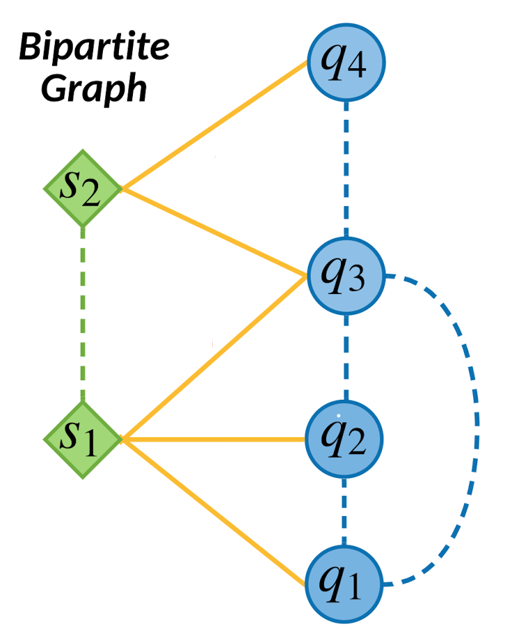
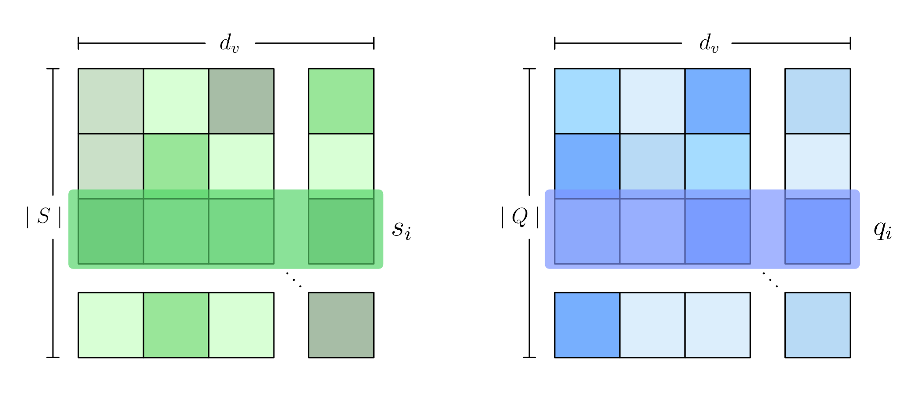
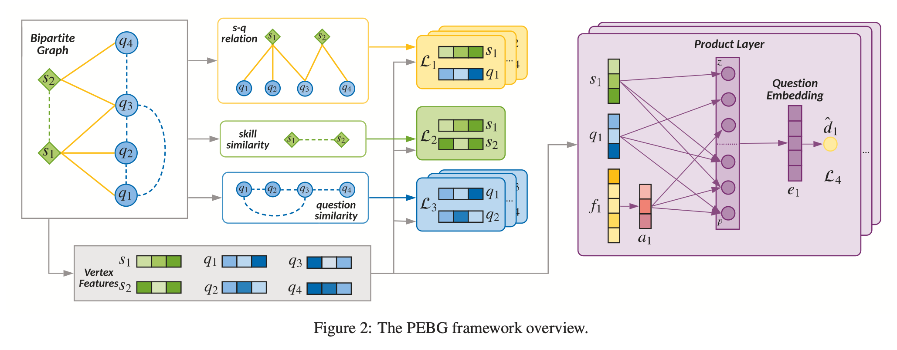
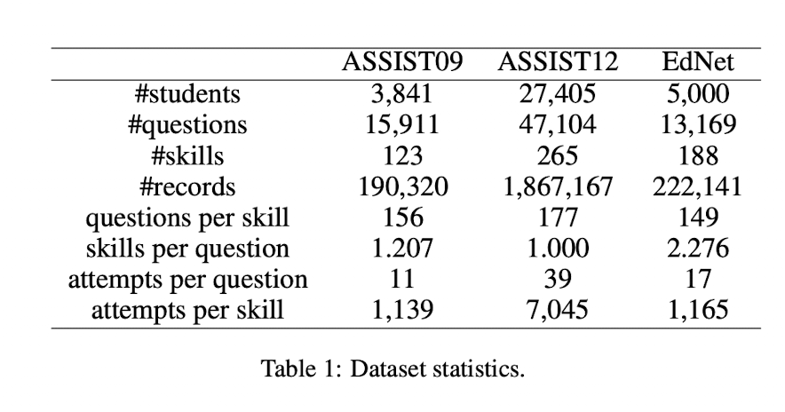
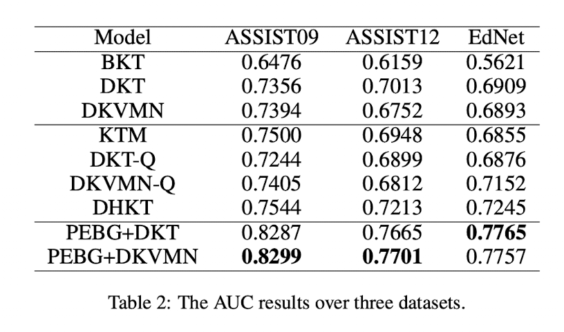

KT 분야에서 question과 skill 사이의 관계 정보가 잘 추출되지 않는 문제가 있음.

본 논문에서는 문제와 스킬 사이의 bipartite graph를 통해서 명시적인 문제와 스킬 사이의 관계 뿐만아니라 문제 난이도와 같은 사이드 정보를 포함하는 embedding을 이용하여 KT의 성능을 끌어올림.

# Question-Skill bipartite graph

Bipartite graph는 명시적인 관계와 암묵적인 관계를 가지고 있음.

Bipartite graph를 두개의 열로 나타낼때 아래와 같이 표현되며, 문제($q$)와 스킬($s$) 사이에서의 관계(실선)는 명시적 관계이고 스킬과 스킬의 유사도, 문제와 문제사이의 유사도(점선)는 암묵적인 관계를 의미한다.

{: width="400"}
> 그림1. question과 skill의 bipartite graph 관계

논문에서는 bipartite graph의 정보를 이용해서 pre-training을 통해 문제의 Embedding vector를 구하고(PEBG) 이를 입력으로 이용해서 기존의 DKT 모델의 변경없이 학습 성능을 향상 시킬 수 있었다고 한다.

# 문제 정의

## DKT

DKT 자체에 대한 정의는 기존과 같지만 bipartite graph에 대한 정의가 추가된다.

학습자의 interaction이 $\mathcal{X} = \{ (q_1, c_1), \dots, (q_{t-1}, c_{t-1}) \}$로 주어지고 이때  $i$시점에서 $q_i$는 학습자가 푼 문제, $c_i$는 학습자의 정답여부(0, 1)라 하면 KT(Knowledge Tracing)의 목적은 $t$시점에서의 학습자가 정답을 맞출 확률 $P(c_t = 1 \mid q_t, \mathcal{X})$를 구하는것 이다.

## Bipartite graph

논문에서는 $Q$와 $S$ 사이의 관계에 bipartite graph를 도입했는데 다음과 같이 표현한다.

문제를 $$Q = \{ q_i \} ^{\mid Q \mid}_{i=1}$$의 집합으로 보고, 스킬을 $S = \{ s_j \}^{\mid S \mid}_{i=1}$ 집합으로 표현한다. 하나의 스킬은 많은 문제를 포함할 수 있고 하나의 문제는 여러 스킬과 관계를 가질 수 있다. (그림1)

이를 bipartite graph의 식으로 정리하면, $G = (Q, S, R)$로 정의할 수 있고 이때  $Q$와 $S$ 사이의 관계는 binary adjacency matrix $ R = [r_{ij}] \in \{ 0, 1 \} ^{\mid Q\mid \times \mid S\mid}$ 로 표현된다.

$q_i$와 $s_j$ 사이의 관계가 있다면 $r_{ij}$는 1이고 아니면 0으로 표기된다.

논문에서 임베딩 사전 학습을 진행하기에 앞서 몇가지 relation에 대한 정의를 내린다.

### Definitions

1. Bipartite graph에서 vertex  $q_i$와 $s_i$ 사이의 edge  $r_{ij}=1$로 둘사이의 관계성을 명시적으로 나타낸다.
2. Bipartite graph에서 vertex  $q_i$를 같이 공유하는 두개의 $s$ vertices의 관계는 skill similarity로 암묵적으로 정의될 수 있다. 비슷하게 vertex  $s_i$를 같이 공유하는 두개의 $q$ vertices의 관계는 question similarity를 의미한다고 볼 수 있다.
3. 문제 $q_i$의 난이도 $d_i$는 training dataset에서 맞춘 비율로 계산된다. 따라서 모든 문제들에 대한 난이도는 벡터 $d = [d_i] \in \mathbb{R}^{\mid Q \mid}$로 표현 가능하다.

# PEBG 의 구조

## Input Features

각 skill, question vertex는 features matrix로 표현되고 랜덤하게 초기화되며 학습 과정에서 학습된다.

skill vertex features는 $S \in \mathbb{R}^{\mid S \mid \times d_v}$의 matrix로 표현된다. matrix의 각 행은 $s_i$를 의미하고 $d_v$의 크기를가진 vector 이다. question vertex features도 마찬가지로 $Q \in \mathbb{R}^{\mid Q \mid \times d_v}$로 표현 가능하다.

이 두가지를 시각적으로 표현하면 다음과 같다.



Attribute features도 존재하는데 이는 문제의 난이도, 평균 응답시간, 문제 타입과 같은  side information을 담고 있다. 논문에서는 하나의 문제 $q_i$에 대해 $m$개의 feature들을 concatenate해서 $f_i = [f_{i1}; ..;f_{im}]$으로 만들게 되는데, 예를들어 $j$번째의 특성이 문제의 카테고리 정보를 담고 있는 feature라면 1-hot vector를, 만약 응답 시간이라면 scalar 값을 concat 하는 식으로 만들었다고 한다.

## Bipartite Graph Constraints

### Explicit

Question-skill 이분 그래프에서 edge는 Q-S 사이의 명시적인 정보를 의미한다.  $q_i$와 $s_i$ 의 내적을 이용해서 둘사이의 관계를 다음과 같이 표현 할 수 있다. (여기서 $\sigma$는 sigmoid function 이다.)

$$
\hat{r}_{ij} = \sigma(q_i^Ts_j), \ i \in [1, \dots , \mid Q \mid], \  j \in [1, \dots , \mid S \mid]
$$

앞서 definitions에서 $q_i$와 $s_i$에 관계가 있는 경우 $r_{ij}=1$로 설정하였기 때문에 Q-S 사이의 relation에 대한 loss에 cross-entropy를 적용해 다음과 같이 나타낼 수 있다.

$$
\mathcal{L}_1(Q, S) = \sum_{i=1}^{\mid Q \mid} \sum_{j=1}^{\mid S \mid} - (r_{ij}log\hat{r}_{ij} + (1-r_{ij})log(1-\hat{r}_{ij}))
$$

### Implicit

나머지 암시적인 정보로는 Q-Q 사이의 유사도와 S-S 사이의 유사도가 있는데 앞서 definitions 에서 서로 비슷하게 연결된 S와 Q의 유사도를 가지고 판단할 수 있다. 

여기서  $q_i$와 연결된 S집합과 $s_i$와 연결된 Q의 집합을 다음과 같이 나타낼 수 있다.

$$
\Gamma_Q (i) = \{s_j \mid r_{ij} = 1\} \\
\Gamma_S (j) = \{q_i \mid r_{ij} = 1\}
$$

이때 Q-Q 유사도 matrix는 $R^Q \ [r^q_{ij} ] \in \{0, 1\}^{\mid Q \mid \times \mid Q \mid}$ 로 나타낼 수 있으며 이때 관계 $r_{ij}$는 다음과 같이 나타낼 수 있다.

$$
r^q_{ij} = \begin{cases} 1 \quad \Gamma_Q (i) \ \cap \ \Gamma_Q (j) \ne \emptyset \\
0 \quad \text{otherise}
\end{cases} \quad ,i,j \in [1, \dots , \mid Q \mid]
$$

> 즉 겹치는 s원소가 있다면 관계는 1이 된다.
{: .prompt-info }

S-S 사이 유사도 matrix도 비슷한 방식으로 $R^S \ [r^s_{ij} ] \in \{0, 1\}^{\mid S \mid \times \mid S \mid}$ 로 나타내며,

$$
r^s_{ij} = \begin{cases} 1 \quad \Gamma_S(i) \ \cap \ \Gamma_S (j) \ne \emptyset \\
0 \quad \text{otherise}
\end{cases} \quad ,i,j \in [1, \dots , \mid S \mid]
$$

여기에서도 내적을 이용해서 feature로부터 예측값을 얻을 수 있고 Q-S 사이의 relation과 계산 방식이 같다.

$$
\hat{r}^q_{ij} = \sigma(q_i^Tq_j), \ i,j \in [1, \dots , \mid Q \mid]
$$

$$
\hat{r}^s_{ij} = \sigma(s_i^Ts_j), \ i,j \in [1, \dots , \mid S \mid]
$$

<br/>

loss도 동일하게 cross-entropy를 사용한다.

$$
\mathcal{L}_2(Q) = \sum_{i=1}^{\mid Q \mid} \sum_{j=1}^{\mid Q \mid} - (r^q_{ij}log\hat{r}^q_{ij} + (1-r^q_{ij})log(1-\hat{r}^q_{ij}))
$$

$$
\mathcal{L}_3(S) = \sum_{i=1}^{\mid S \mid} \sum_{j=1}^{\mid S \mid} - (r^s_{ij}log\hat{r}^s_{ij} + (1-r^s_{ij})log(1-\hat{r}^s_{ij}))
$$

## Difficulty Constraint

KT에 있어서 난이도 정보는 매우 중요하다. 하지만 bipartite graph에는 포함된 정보가 아니기 때문에 따로 연산이 필요하다. 논문에서는 product layer를 활용해서 difficulty 정보를 학습하고 있다.

일단 하나의 $q_i$에 대해서 question vertex feature $q$와 attribvute features $f$를 가지고 있다고 하자. 이때 $f$는 dense layer에 의해 크기가 $a \in \mathbb{R}^{d_v}$로 임베딩 되어있다고 가정한다.

앞서 $q_i$와 관련이 있는 skill들이 여러개 존재하는데 ($C =\{s_j\} ^{\mid C \mid}_{j=1}$) 이 skill들의 vertex feature를 평균내서 아래처럼 이용하게 된다. 

$$
s' = {1 \over {\mid C \mid}} \sum_{s_j \in C} s_j
$$

이제 $q$, $a$, $s'$를 결합해서 만든 $Z$와 $q_i$ 에대한 이차 정보를 담고있는 $P$로 정리할 수 있다.

$$
\begin{align}
Z &= (z_1, z_2, z_3) \triangleq (q, s', a) \\
P &= [p_{ij}] \in \mathbb{R}^{3 \times 3}
\end{align}
$$

이때 $p_{ij} = g(z_i, z_j)$를 의미하고 논문에서는 내적을 이용하였다.

$Z$와 $P$가 product layer를 지나면 각각 $l_z,l_p$벡터가 되고 여기에 relu activation을 적용하면 embedding $e$를 구할 수 있다.

> 여기서 논문에서 설명했던 수식을 제외했는데 아래 코드로 설명하는것이 이해가 잘 되어서 제외하였다.
{: .prompt-tip }

$e$가 한번 더 dense layer를 통과시켜 앞서 구했던 question difficulty 정보의 형태로 만들면 다음과 같이 표현할 수 있다.

$$
\hat{d}_i = w^T_d e_i + b_d
$$

이를 통해서 앞서 구한 $d_i$와 비교하면 다음과 같이 difficulty에 대한 MSE loss를 구할 수 있다.

$$
\mathcal{L}_4(Q, S, \theta) = \sum^{\mid Q \mid}_{i=1} (d_i -\hat{d}_i)^2
$$

논문의 공식 리포지토리에서는 효율적인 계산을 진행하였는데 PNN의 코드는 다음과 같다. ([전체 코드](https://github.com/ApexEDM/PEBG)는 tf-v1 기반이다.)

우선 $q, s', a$에 대한 정의는 다음과 같다.

```python
# embed_dim = 64 -> project setting.

pro_embed # [bs, embed_dim] Q
diff_feat_embed # [bs, embed_dim] a
skill_embed # [bs, embed_dim] S
```

이때 PNN은 다음과 같이 수행된다.

```python
e, p = pnn([pro_embed, skill_embed, diff_feat_embed], embed_dim, hidden_dim, tf_keep_prob[0])
```

PNN에서는 리니어하게 결합한 $Z$(`xw`)와 각 임베딩 feature들의 quadratic 조합인 P(`xw3d` 의 각 조합별 합)를 구하고  dense layer에 통과시킨다.

```python
def pnn(inputs, embed_size, hidden_dim, keep_prob):
    # imputs = [pro_embed, skill_embed, diff_feat_embed]
    num_inputs = len(inputs) # 3
    num_pairs = int(num_inputs * (num_inputs-1) / 2) # 3

    # 아래의 3이 의미하는 것은 imputs = [pro_embed, skill_embed, diff_feat_embed]를 의미한다.
    xw = tf.concat(inputs, 1) # [bs, 3 * embed_dim] Z
    xw3d = tf.reshape(xw, [-1, num_inputs, embed_size])  # [batch_size, 3, embedding_size]

    row = []
    col = []
    for i in range(num_inputs-1):
        for j in range(i+1, num_inputs):
            row.append(i)
            col.append(j) # row = [0 0 1]  col = [1 2 2]
    # row, col 조합은 [0, 1] [0, 2], [1, 2] 이 조합이 p_ij 이다.

    # batch * pair * k
    p = tf.transpose(
        # pair * batch * k
        tf.gather(
            # num * batch * k
            tf.transpose(
                xw3d, [1, 0, 2]), # [3, batch_size, embedding_size] 
                # 여기서 3은 pro_embed, skill_embed, diff_feat_embed
            row), # pro_embed, pro_embed, skill_embed의 feature가 추출
        [1, 0, 2])  # [batch_size, 3, embedding_size]
        # 여기서 3은 pro_embed, pro_embed, skill_embed

    # batch * pair * k
    q = tf.transpose(
        tf.gather(
            tf.transpose(
                xw3d, [1, 0, 2]), # [3, batch_size, embedding_size] 
                # 여기서 3은 pro_embed, skill_embed, diff_feat_embed
            col), # skill_embed, diff_feat_embed, diff_feat_embed가 추출
        [1, 0, 2]) # [batch_size, 3, embedding_size]으로 변경.
        # 여기서 3은 skill_embed, diff_feat_embed, diff_feat_embed

    p = tf.reshape(p, [-1, nu m_pairs, embed_size])
    q = tf.reshape(q, [-1, num_pairs, embed_size])
    ip = tf.reshape(tf.reduce_sum(p * q, [-1]), [-1, num_pairs]) # [batch_size, 3] P
    # inner product and sum.

    l = tf.concat([xw, ip], 1) # [batch_size, 3 * embed_dim + 3]
    # xw = l_z, ip = l_p

    h = tf.layers.dense(l, units=hidden_dim, activation=tf.nn.relu) # embedding e
    h = tf.nn.dropout(h, keep_prob=keep_prob)
    p = tf.reshape(tf.layers.dense(h, units=1), [-1])
    return h, p
    # h는 embedding e, p는 h가 dense layer를 한번더 거쳐서 difficulty를 구하는데 사용된다.
```

## Joint Optimization

앞서 설명한 loss를 모두 합쳐 학습을 시키면 question에 대해 embedding된 $e$를 구할 수 있고 아래의 함수를 최소화 하는 문제가 된다.

$$
\text{min}_{Q,S, \theta}\ \lambda(\mathcal{L}_1(Q, S) + \mathcal{L}_2(Q) + \mathcal{L}_3(S)) + (1- \lambda) \mathcal{L}_4 (Q,S,\theta)
$$

이때 $\lambda$는 이분 그래프의 조건과 난이도 조건의 비율을 조정하는 파라미터가 된다.

이를 위한 PEBG의 전체 구조는 다음과 같다.



# Experiments

실험에서는 [ASSIST09](https://sites.google.com/site/assistmentsdata/home/assistment-2009-2010-data/skill-builder-data-2009-2010)(웹사이트는 주소가 변경된것 같고 [링크](https://drive.google.com/file/d/1NNXHFRxcArrU0ZJSb9BIL56vmUt5FhlE/view)에서 데이터는 받을 수 있다.), [ASSIST12](https://sites.google.com/site/assistmentsdata/2012-13-school-data-with-affect?authuser=0), [EdNet](https://github.com/riiid/ednet) 데이터를 사용하였다.

{: width="400"}

{: width="400"}

DKT만 살펴보면 DKT는 skill-level의 모델로 Q의 스킬 정보를 입력으로 이용하게 된다. DKT-Q는 논문에서 DKT를 question-level로 확장시킨 모델 (Q 자체를 입력으로 받는다는데 어떤식으로 입력이 들어가는지는 모르겠다.)이다. PEBG+DKT는 임베딩된$q$인 $e$를 입력으로 넣어서 학습했을때의 결과이다.

DKT만을 이용했을때보다 약 9% 정도의 AUC 향상이 있는것을 볼 수 있다.

## question, skill level

논문에서는 학습 테스트에서 모델을 `skill-level`, `question-level` 두개의 분류로 나누고 있다.   
다른 논문들도 살펴보면 크게 다음과 같이 표현할 수 있을것 같다.


### skill-level model

살펴보면 skill-level은 DKT처럼 문제를 skill_id로 분류한다.

```python
n_skill = 10

# 시간에 따른 기록.
skills = [0, 1, 5, 2, 7]
corrects = [0, 1, 0, 1, 0]

input = [corrects * n_skill + skill_id for idx, skill_id in enumerate(skills)]
```

- question 자체의 context는 무시하고 category만 고민하기 때문에 일부 데이터의 손실이 있다.
- 새로운 question에 대해서도 바로 적용이 가능하다.
- 복합 category를 가진 문제에 대해서는 처리가 힘들다.


### question-level model

question-level은 DKT처럼 문제를 question_id로 분류한다.

```python
n_question = 2000

# 시간에 따른 기록.
questions = [15, 1200, 207, 219, 1700]
corrects = [0, 1, 1, 1, 0]

input = [corrects * n_question + question_id for idx, question_id in enumerate(questions)]
```

- question_id로 분류하기 때문에 같은 유형의 문제라도 문제자체의 context 정보를 가지고 있을 수 있다.
- 하나의 question이 여러 skill category를 가지고 있어도 학습 가능하다.
- 문제가 새롭게 추가되는경우 학습을 다시 진행해야 한다.
