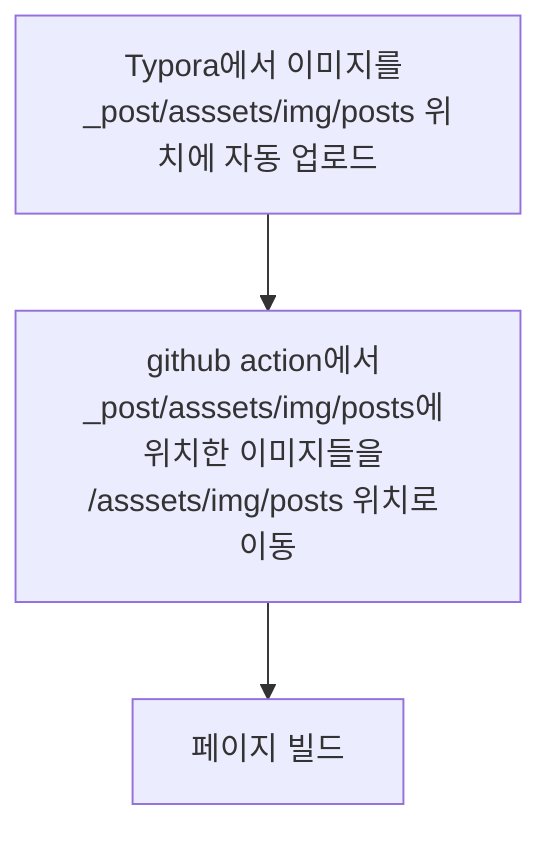

# Typora

Typora는 유료 마크다운 에디터이다. 간결하고 깔끔하며 미리 결과를 보면서 작성할 수 있어서 사용하기 좋다.

일반적으로 마크다운에서 이미지를 추가하려면 특정 path에 이미지를 추가하고 다음과 같은 구문을 이용해서 이미지를 로딩한다.

~~~markdown

~~~

일반적인 문서작성 용도라면 작성하기 크게 어렵지 않으나 포스팅처럼 간편하게 올리고, 이미지가 많이 들어가는 경우에는 이미지를 업로드하고 path를 지정해주는 작업이 매우 불편하다.

또한 Typora에서 참조하는 이미지의 path와 chirpy(현재 블로그의 테마로 [Jekyll](https://jekyllrb.com/) 기반 테마이다.)테마에서 원하는 이미지 path가 다르기 때문에 아래처럼 path 지정 방식에 따라 하나씩 안보여지는 구조가 된다.

- chirpy 테마에서 이미지 인식 위치: `/assets/img/~`
- Typora 에서 이미지 인식 위치: `_post/~` _(마크다운이 있는 디렉터리)_

| target                 | path        |  결과                                       |
| -------------------- |  ---------------------- | ------------------------------------------ |
| editor에 맞추는 경우 |  `_posts/imgs/test.png`  | Typora에서는 인식하나 chirpy에서 인식 불가 |
| theme에 맞추는 경우 |  `assets/imgs/test.png` | chirpy에서는 인식하나 Typora에서는 인식 불가 |

## 둘다 보이게 하는 방법은 없을까?

포스팅을 하면서 이미지도 확인하고 싶고 바로 github에 올렸을때 이미지가 잘 배포되게하면 포스팅이 매우 간편하게 이루어질 수 있다.
이를 위해서 github action을 이용해보기로 하였다.

일반적으로 github-page에 배포는 giuthub action을 통해서 이루어진다. 이를 이용해서 editor와 theme의 조건을 맞추기 위해서 **github action에서 빌드를 수행하기 전에 이미지를 chirpy에서 인식가능한 위치로 이동시켜주면** 둘 모두 이미지를 표시할 수 있지 않을까라는 생각이 들었다. (다만 이미지가 많아지면서 이미지 이동시간에 따라 증가하는 빌드 시간은 조금 길어질 수 있을것으로 예상한다.)

## github action을 이용하자!

github action과 관련된 파일은 `/github/workflows/pages-deploy`에서 찾아볼 수 있었다. 내용은 잘 모르지만 `checkout`-`ruby 설정`- `빌드` 순으로 진행이 되고 있었다.

~~~yaml
name: 'Automatic build'
on:
  push:
    branches:
      - master
    paths-ignore:
      - .gitignore
      - README.md
      - LICENSE

jobs:
  continuous-delivery:

    runs-on: ubuntu-latest

    steps:
      - name: Checkout
        uses: actions/checkout@v2
        with:
          fetch-depth: 0  # for posts's lastmod

      - name: Setup Ruby
        uses: ruby/setup-ruby@v1
        with:
          ruby-version: 2.7
          bundler-cache: true

      - name: Deploy
        run: bash tools/deploy.sh

~~~

여기서 봐야할 부분은 `Deploy`에서 `tools/deploy.sh`를 실행하는 부분인데 이 스크립트를 살펴보면 다음과 같다.

~~~bash
main() {
  init
  build
  test
  resume_site_dir

  if $_opt_dry_run; then
    exit 0
  fi

  setup_gh
  backup
  flush
  deploy
}
~~~

위에서 보이는것처럼 테스트하고 빌드하고 배포하는 작업의 연속으로 보여진다. **여기에 새로운 이미지 이동함수를 추가하면 되겠다**.

기본 아이디어의 Typora의 설정과 github action의 workflow를 보면 다음과 같다.

### Typora 자동 업로드

Typora에서는 이미지를 드래그하거나 클립보드의 이미지를 붙혀넣기하면 특정 위치로 이미지를 저장할 수 있다. `Typora`-`환경설정`-`이미지`를 보면 아래 사진처럼 이미지 삽입 시 `사용자 정의 폴더로 이미지 복사`를 수행할 수 있다. 스크린샷에서도 볼 수 있듯 현재 폴더를 기준으로 상대 경로를 작성해야한다. 
아래 사진처럼 `./assets/img/posts`로 지정하면 해당 위치(`_post/`)로 이미지가 저장되고 해당 path가 자동으로 입력되어서 바로 이미지를 볼 수 있다.

>사진에서는  `./assets/img/posts/`로 지정되었는데 이렇게 하는 경우 이미지 path가  `./assets/img/posts//images.png`로 이중 slash를 가지게 된다.
{: .prompt-tip }

### github action 배포 스크립트에 이미지 이동함수 추가하기

이제 이미지는 `_post/`위치에 잘 업로드 되었고 Typora에서도 잘 인식한다. 이제는 github page에서 인식할 수 있도록 빌드시 이미지를 `assets/`위치로 이동시켜준다.

1. `deploy.sh`에 다음과 같은 함수를 추가해준다.
   ~~~bash
   shift_imgs(){
     mkdir assets/img/posts
     mv _posts/assets/img/posts/* assets/img/posts
   }
   ~~~
   >`assets/img/posts` 디렉터리가 없는 경우 폴더를 찾을 수 없다는 오류가 발생하게 된다. 따라서 `mkdir`를 추가하여 디렉터리를 생성하였다. 
   {: .prompt-warning }
2. `main()`에 해당 함수를 추가해준다. build 함수가 페이지를 빌드하고 있어서 `init()`과 `build()`사이에 이미지 이동함수를 추가하였다.

   ~~~bash
   main() {
     init
     shift_imgs
     build
     test
     resume_site_dir
   
     if $_opt_dry_run; then
       exit 0
     fi
   
     setup_gh
     backup
     flush
     deploy
   }
   ~~~

   

### img_path 설정하기

이제 모든게 잘 될것 같은데 웹사이트에서 이미지가 잘 보이지 않는다. 그 이유는 이미지의 path가 `assets/img/posts/test.png`로 지정되어있지만 상대경로로 인식하기 때문에 빌드된 프로젝트에서  `{path_post}/assets/img/posts/test.png`위치에서 파일을 찾기 때문에 이미지가 안보인다.

이를 방지하기 위해서 작성중인 포스트 마크다운 상단에 `img_path` 파라미터를 추가해준다.

~~~markdown
---
img_path: /
---
~~~

이렇게 작성하는 경우 `assets/img/posts/test.png` 로 작성하면 `/assets/img/posts/test.png`로 인식하게되어 잘 보이게 된다.

이번 포스트에서는 테마에서 지원하는 기능들을 이용해보고 실제 이미지 업로드가 잘 이루어지는지 확인하기 위해서 좀더 다양한 방법으로 내용을 추가하였다. 사실 vscode 사용하면 간단하게 사용할 수도 있는데 블로그는 글만 작성 잘하면 되니까... 이렇게 세팅해두고 쓰니 확실히 글 쓰기가 편하다.

이제 Typora를 구매하는 것만 남았다.. (평가 기간 동안 더 써봐야지..)

