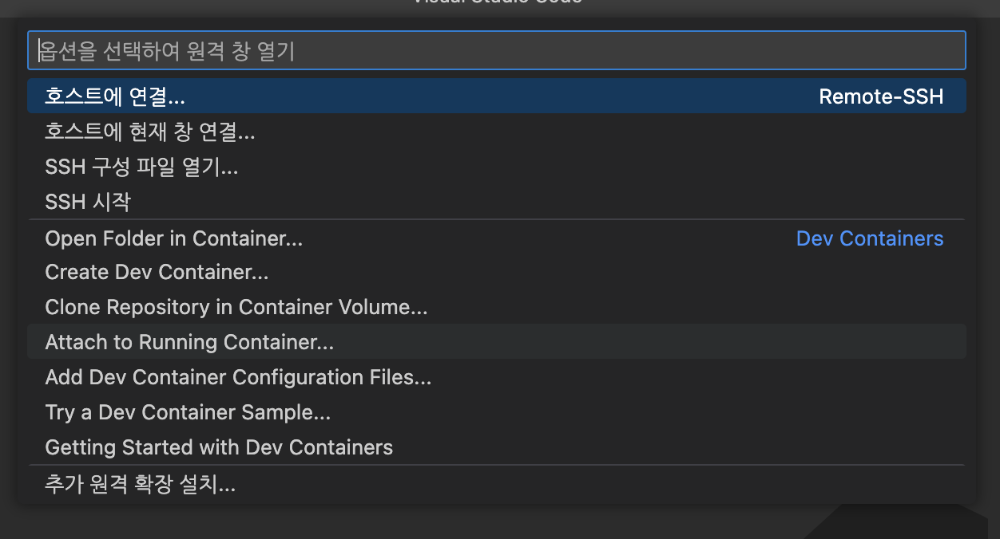

# devcontainer

일반적으로 container 내부에서 작업을 하거나 ssh를 통해서 원격으로 작업을 하는경우 Microsoft에서 만들어둔 **Remote Development**([ms-vscode-remote.vscode-remote-extensionpack](https://marketplace.visualstudio.com/items?itemName=ms-vscode-remote.vscode-remote-extensionpack))를 사용하게 된다. (없으면 일이 안된다...)


문제는 요즘 대부분의 개발을 Docker container환경에서 진행하고 있는데 Docker run 명령어는 매번 파라미터를 넣어줘야 해서 매우 불편하다.

```shell
$ docker run --rm -i -t -v ~~ ...
```


그에대한 대안으로 Docker-compose가 있지만 이것도 불편하기는 마찬가지이다.

단순히 실행 뿐만 아니라 컨테이너가 꺼지지 않도록 커멘드 명령도 compose 파일에 추가해둬야한다.

```shell
$ docker-compose up
```


또한 docker나 docker-compose모두 매번 컨테이너를 열고 또 아래의 `Attach to running container`를 눌러서 컨테이너 안으로 들어가는 작업을 해주어야 한다.



_해당 패널은 좌측 하단의 리모트 열기 버튼을 누르면 나온다. _


우연하게 다른 리포지토리를 살펴보다 `.devcontainer`라는 폴더를 보았는데 알아보니 매우 쉽게 컨테이너를 열고 동시에 vscode를 연결할 수 있는 기능이었다.


## settings

vscode의 devcontainer를 사용하기 위해서는 몇가지 설정이 필요하다.


1. `.devcontainer`라는 디렉터리를 생성해준다. 
2. `devcontainer.json`, `dockerfile`, `docker-compose.yml` 파일을 디렉터리 안에 생성해준다.


간단하게 딥러닝 관련 라이브러리가 설치되어있는 환경을 세팅해본다.

### Dockerfile

도커 파일 자체는 단순하다. 일반 이미지를 만들듯 설정해주면 된다.

```dockerfile
FROM nvidia/cuda:11.2.2-cudnn8-devel-ubuntu20.04
ENV DEBIAN_FRONTEND noninteractive

RUN apt-get update && apt install -yq \
    python3 \
    pip \
    libgl1-mesa-glx \
    libglib2.0-0 \
    libssl-dev \
    git \
    vim

RUN pip install --upgrade pip

RUN pip install \
    black \
    tensorflow \
    torch \
    torchvision \
    torchaudio --extra-index-url https://download.pytorch.org/whl/cu113 \
    opencv-python \
    pandas \
    numpy \
    matplotlib

RUN ln -s /usr/bin/python3 /usr/bin/python

# zsh install.
RUN chsh -s $(which zsh)

# oh-my-zsh setting.
RUN curl -L https://raw.github.com/robbyrussell/oh-my-zsh/master/tools/install.sh | sh
RUN sh -c "$(wget -O- https://github.com/deluan/zsh-in-docker/releases/download/v1.1.5/zsh-in-docker.sh)" -- \
    -t robbyrussell \
    -p git \
    -p ssh-agent \
    -p https://github.com/zsh-users/zsh-autosuggestions \
    -p https://github.com/zsh-users/zsh-completions

# .zshrc 파일은 미리 플러그인이 추가된 양식을 만들어 두었다.
COPY .zshrc ~/.zshrc
```


### docker-compose.yml

compose 파일의 경우에는 root 디렉터리에 특정 폴더안에 프로젝트명과 같은 폴더에 볼륨을 만들도록 설정하였다.

여기서 이미지 이름, 서비스 앱 이름은 자유롭게 설정하면 된다. 나머지 설정은 평상시 설정한던 옵션으로 세팅해주면 된다.

```yaml
version: "3"
services:
  ai-env:
    image: "test:ai-env"
    build:
      context: .
    working_dir: /{project_name}
    volumes:
      - $PWD:/{project_name}
    ipc: host
    network_mode: host
    environment:
    	- NVIDIA_VISIBLE_DEVICES= 1, 2
```


### devcontainer.json

사실 위의 dockerfile이나 docker-compose.yml 파일은 일반적으로 docker-compose를 이용한 컨테이너 환경을 구성할때와 같은 구조이다. 이 `devcontainer.json` 파일을 통해서 vscode로 쉽게 container 환경을 만들 수 있도록 세팅해주는 역할을 한다.

`dockerComposeFile`, `workspaceFolder`, `service`를 위의 docker-compose 파일에서 지정한것과 같게 설정해주면 된다.

vscode와 연동답게 기본적인 setting이나 extension을 미리 설치해둔 환경을 만들어둘 수 있다. 각각 `settings`와 `extensions`에 작성해준다.

```json
{
    // https://code.visualstudio.com/docs/remote/devcontainerjson-reference
    "name": "AI Training Development Container",
    "dockerComposeFile": "docker-compose.yml",
    "workspaceFolder": "/{project_name}",
    "service": "ai-env",
    "overrideCommand": true,
    "settings": {
        "terminal.integrated.defaultProfile.linux": "zsh",
        "editor.rulers": [
            80,
            100
        ],
        "editor.formatOnSave": true,
        "python.formatting.provider": "black"
    },
    "extensions": [
        "GitHub.vscode-pull-request-github",
        "ms-azuretools.vscode-docker",
        "ms-python.python",
        "oderwat.indent-rainbow",
        "PKief.material-icon-theme"
    ]
}
```


이러고 나서 아까 위에서 살펴본 원격 접속 모달을 살펴보면 아래와 같은 항목을 확인할 수 있다!


해당 항목을 클릭하면 container 환경을 만들기 위해 빌드도 알아서 해주고 설정해둔 디렉터리 위치(`workspaceFolder`)에 맞춰서 vscode를 세팅해준다. 반대로 다시 돌아올때는 `Reopen Foler in ~~` 을 클릭해서 나올 수 있다. 


별거 아니긴 하지만 정말 편리해서 이제 알았다는게 너무 아쉬어서 글로 남겨본다.
